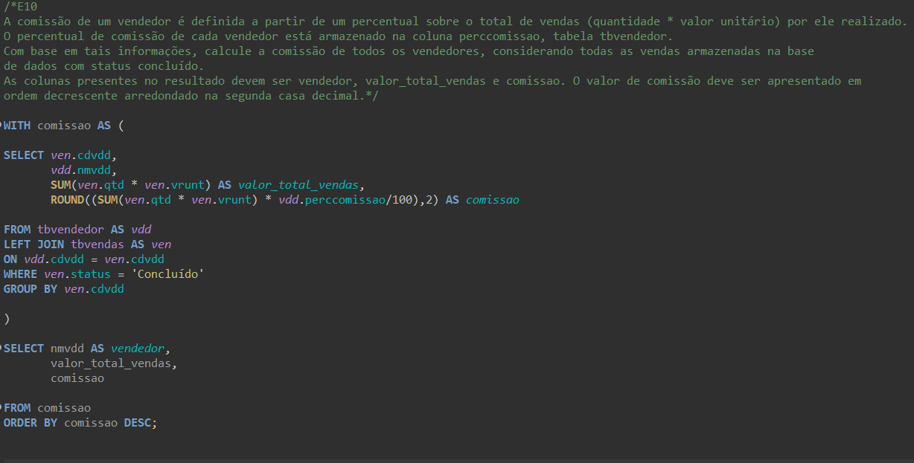

# Resumo

**Scrum:** Eu aprendi que o Scrum é uma metodologia ágil organizada em três partes principais. Nos papéis, 
entendi que o Product Owner é quem organiza as demandas, o Scrum Master agiliza o trabalho do time e o Time de Desenvolvimento 
é responsável por executar as tarefas. Nos artefatos, descobri que o backlog lista as tarefas e o burndown acompanha o 
progresso do time. Por fim, nos eventos, compreendi que as sprints organizam o trabalho,
 enquanto as reuniões diárias, os reviews e as retrospectivas ajudam a validar e melhorar o processo.

**Git e GitHub:** Eu já tinha um breve conhecimento sobre Git e Github mas o curso me ajudou demais a relembrar o comando de "git status"
e de "-m" ao fazer commit, comandos que eu nem lembrava mais devido a não ter tido prática com git e github.

**SQL:** Eu aprendi que o SQL é uma linguagem usada para gerenciar e consultar bancos de dados relacionais. Com ele, é possível 
criar tabelas, inserir e atualizar dados, além de realizar consultas utilizando comandos como SELECT e WHERE.

**Modelagem Relacional e Dimensional:** Eu aprendi que a modelagem relacional organiza os dados em tabelas normalizadas para evitar
 redundância, enquanto a modelagem dimensional é focada em simplificar a análise, 
utilizando tabelas fato e dimensões para facilitar a leitura e interpretação dos dados.

# Exercícios

## Exercícios 1

1. ...
[Resposta Ex1.](Exercícios/Exercícios_1/E01.sql)

2. ...
[Resposta Ex2.](Exercícios/Exercícios_1/E02.sql)

3. ...
[Resposta Ex3.](Exercícios/Exercícios_1/E03.sql)

4. ...
[Resposta Ex4.](Exercícios/Exercícios_1/E04.sql)

5. ...
[Resposta Ex5.](Exercícios/Exercícios_1/E05.sql)

6. ...
[Resposta Ex6.](Exercícios/Exercícios_1/E06.sql)

7. ...
[Resposta Ex7.](Exercícios/Exercícios_1/E07.sql)

8. ...
[Resposta Ex8.](Exercícios/Exercícios_1/E08.sql)

9. ...
[Resposta Ex9.](Exercícios/Exercícios_1/E09.sql)

10. ...
[Resposta Ex10.](Exercícios/Exercícios_1/E10.sql)

11. ...
[Resposta Ex11.](Exercícios/Exercícios_1/E11.sql)

12. ...
[Resposta Ex12.](Exercícios/Exercícios_1/E12.sql)

13. ...
[Resposta Ex13.](Exercícios/Exercícios_1/E13.sql)

14. ...
[Resposta Ex14.](Exercícios/Exercícios_1/E14.sql)

15. ...
[Resposta Ex15.](Exercícios/Exercícios_1/E15.sql)

16. ...
[Resposta Ex16.](Exercícios/Exercícios_1/E16.sql)

## Exercícios 2

1. ...
[Resposta Ex1.](Exercícios/Exercícios_2/Etapa_1.sql)

2. ...
[Resposta Ex1.](Exercícios/Exercícios_2/Etapa_2.sql)

# Evidências

Ao fazer o código desse exercício eu lembrava vagamente sobre as propriedades de subqueries, então quando eu fiz a subquerie 
eu não sabia muito bem como utilizar os dados da subquerie na querie principal, mas depois consultando o colega do Squad eu 
aprendi que precisa colocar a subquerie no "From" da Querie principal, por esse motivo meu código não rodava de jeito nenhum anteriormente,
 pois eu tentava utilizar as colunas da subquerie através de Alias de tabelas da própria subquerie.

Execução do código:

.png)

