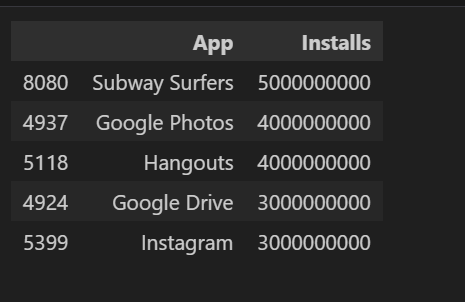
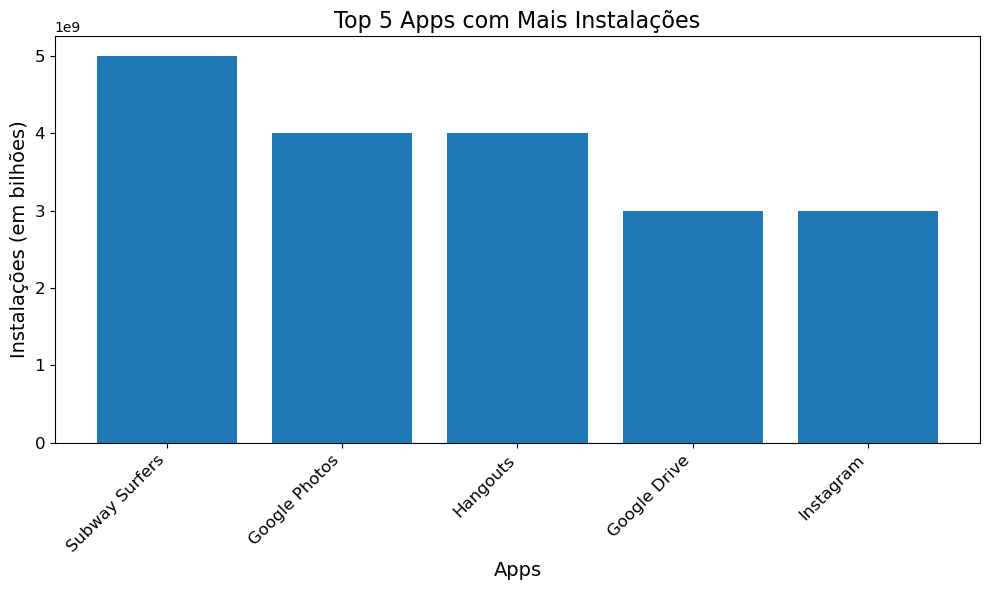
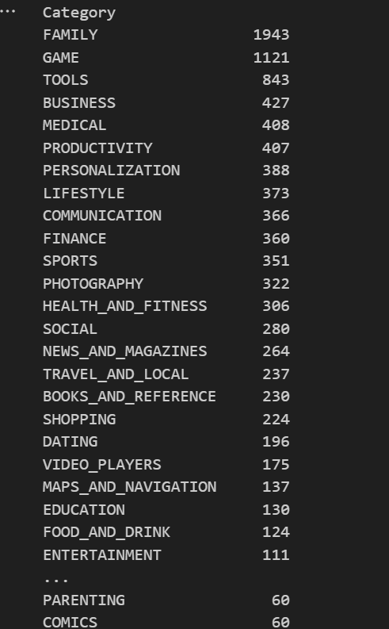
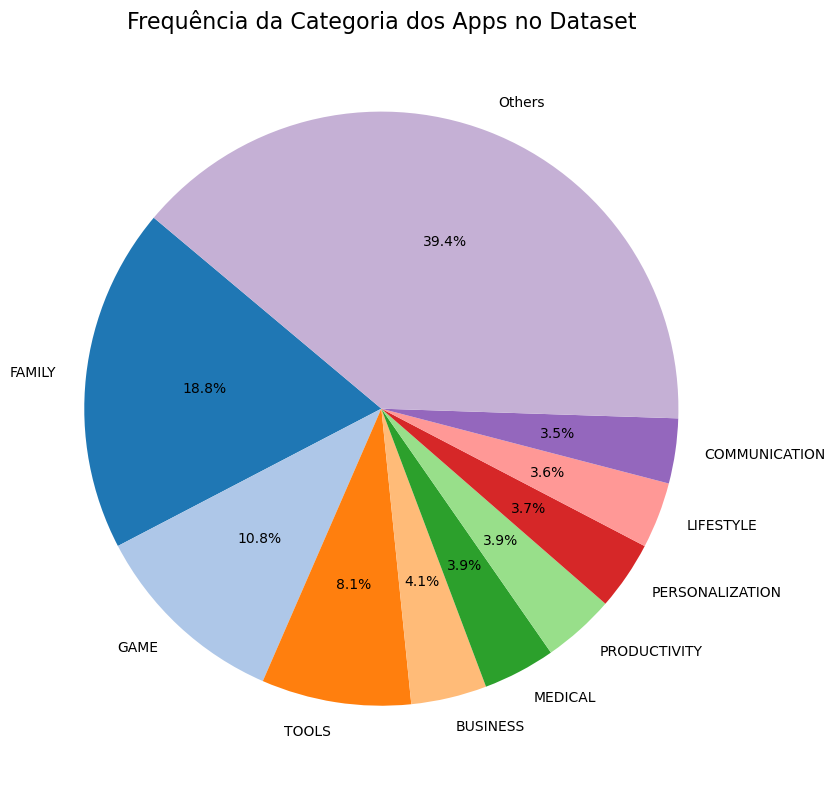
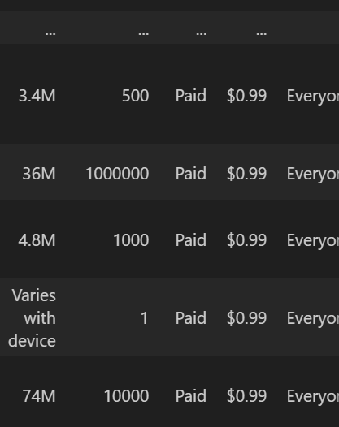
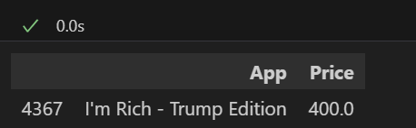
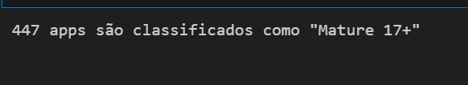
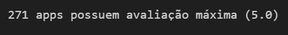
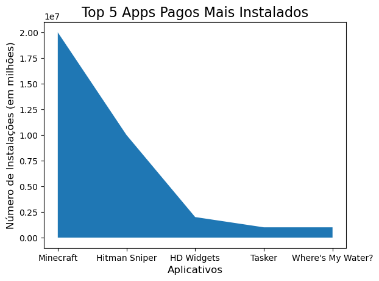
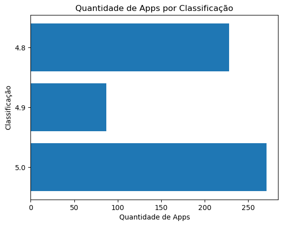

# Início do Notebook

Importei as bibliotecas Pandas e Matplotlib respectivamente. Segue o código:

    import pandas as pd
    import matplotlib.pyplot as plt

No segundo bloco fiz a abertura do arquivo CSV com o Pandas:

    dados = pd.read_csv('googleplaystore.csv')

# Etapas

## 1. Remoção de linhas duplicadas

    dados = dados.drop_duplicates()
Nessa linha de código usei a função "drop_duplicates()" para remover as linhas duplicadas, garantindo a qualidade e a integridade dos dados. 

## 2. Gráfico de barra contendo os top 5 apps por número de instalação 
No primeiro bloco de código já procurei pelos 5 apps com maior número de instalações, porém me deparei com uma inconsistência, o número de instalações em primeiro lugar aparecia "free" invés de um número.

Então fui procurar pelo índice 10472 no arquivo CSV, e descobri que não havia um valor para a coluna "Category", então todos os valores das colunas posteriores passaram a ocupar a coluna anterior, sendo assim, a solução que eu tive foi informar em "Category" que o app não foi categorizado, e adicionei os outros atributos em suas respectivas colunas.

Código:

    indice = 10472
    dados.loc[indice, "App"] = "Life Made WI-Fi Touchscreen Photo Frame"
    dados.loc[indice, "Category"] = "Uncategorized app"
    dados.loc[indice, "Rating"] = "1.9"
    dados.loc[indice, "Reviews"] = "19"
    dados.loc[indice, "Size"] = "3.0M"
    dados.loc[indice, "Installs"] = "1,000+"
    dados.loc[indice, "Type"] = "Free"
    dados.loc[indice, "Price"] = "0"
    dados.loc[indice, "Content Rating"] = "Everyone"
    dados.loc[indice, "Genres"] = "Tools"
    dados.loc[indice, "Last Updated"] = "February 11, 2018"
    dados.loc[indice, "Current Ver"] = "1.0.19"
    dados.loc[indice, "Android Ver"] = "4.0 and up"

Como eu percebi que tinha vírgula e "+" nos números, eu tirei o que não era número da coluna e converti toda a coluna em int para não abrir espaço a erros.

Código:

    dados['Installs'] = dados['Installs'].str.replace('[+,]', '', regex=True).astype(int)

Depois de tratar os dados, fui agrupar as somas das instalações pelo nome do app e descobri os 5 apps com maiores números de instalações.

Código:

    dados_agrupados = dados.groupby('App')['Installs'].sum().reset_index()

    dados_agrupados.sort_values('Installs', ascending=False).head(5)

Execução:

Após, fiz o código para gerar com o matplotlib o gráfico de barras. 

Código:

    top5_installs = dados_agrupados[['App', 'Installs']].sort_values('Installs', ascending=False).head(5)
    fig, ax = plt.subplots(figsize=(10, 6))
    ax.bar(top5_installs['App'], top5_installs['Installs'])

    plt.title("Top 5 Apps com Mais Instalações", fontsize=16)
    plt.xlabel("Apps", fontsize=14)
    plt.ylabel("Instalações (em bilhões)", fontsize=14)
    plt.xticks(rotation=45, ha='right', fontsize=12)
    plt.yticks(fontsize=12)

    plt.tight_layout()
    plt.show()

Gráfico:

## 3. Gráfico de pizza que mostra as categorias de acordo com a frequência em que aparecem no Dataset

Descobrindo a frequência que cada categoria aparece no Dataset.

Código:

    frequencias = dados['Category'].value_counts()

    frequencias

Execução:

Como o Dataset possui muitas categorias, eu agrupei os dados que correspondem menos de 3,5% do Dataset e atribuí a uma nova categoria chamada "Outras" para não poluir o gráfico e dificultar a análise.

Código:

    limite = 0.035 * frequencias.sum() 
    frequencias_relevantes = frequencias[frequencias >= limite]  
    frequencia_outras = frequencias[frequencias < limite].sum()

    frequencias_relevantes['Others'] = frequencia_outras 

Criando o gráfico:

    labels = frequencias_relevantes.index
    sizes = frequencias_relevantes.values

    plt.figure(figsize=(10, 8))
    plt.pie(sizes, labels=labels, autopct='%1.1f%%', startangle=140, colors=plt.cm.tab20.colors)
    plt.title('Frequência da Categoria dos Apps no Dataset', fontsize=16)

    plt.tight_layout()
    plt.show()

Gráfico:

## 4. App mais caro existente no Dataset

Ao executar o seguinte código para descobrir o app mais caro:

    dados.sort_values('Price', ascending=False)

Execução:

Percebi que na coluna "Price" tem um caractere "$" que dificulta a comparação de preços, sendo assim, tirei esse caratere e atribuí a toda coluna o tipo float.

Código:

    dados['Price'] = dados['Price'].str.replace('$', '').astype(float)

Depois de tratado os dados, consegui descobrir o app mais caro.

Código: 

    dados[['App','Price']].sort_values('Price', ascending=False).head(1)

Execução:

## 5. Quantidade de apps classificados como "Mature 17+"

Utilizei a função .loc[ ] para filtrar linhas que tenham apenas "Content Rating" igual a "Mature 17+" e o len() para poder fazer a contagem, e tive sucesso.

Código:

    mature_17_plus = len(dados.loc[dados['Content Rating'] == 'Mature 17+'])
    print(f'{mature_17_plus} apps são classificados como "Mature 17+"')

Execução:

## 6. Top 10 apps por número de Reviews

Converti a coluna de "Reviews" em int e depois ordenei a coluna em ordem decrescente deixando apenas o top 10, porém me encontrei com um problema ao perceber que havia apps se repetindo.

Código:

    dados['Reviews'] = dados['Reviews'].astype(int)
    dados[['App', 'Reviews']].sort_values('Reviews', ascending=False).head(10)

Execução:

Para tratar isso, eu tirei a média dos Reviews de Apps que se repetiram e agrupei.

Código:

    dados_agrupados = dados.groupby('App')['Reviews'].mean().reset_index()

    dados_ordenados = dados_agrupados.sort_values('Reviews', ascending=False)

    dados_ordenados.head(10)

Execução:

## 7. Adicionar mais 2 cálculos sobre o Dataset, sendo o primeiro retornando uma lista e o segundo um valor

### 7.1 Top 5 apps pagos mais instalados

Somei as instalações e agrupei a soma pela coluna "App" e filtrei para somar apenas onde o "Type" fosse "Paid", e tive sucesso com o código.

Código:

    dados_agrupados = dados.loc[dados['Type'] == 'Paid'].groupby('App')['Installs'].sum().reset_index()

    dados_agrupados.sort_values('Installs', ascending=False).head(5)

Execução:

### 7.3 Quantidade de Apps com a classificação 5.0

Percebi que a coluna de "Rating" era do tipo "Object" então converti a coluna para tipo numérico e o argumento errors='coerce' na função pd.to_numeric() tenta converter os valores de uma coluna para numérico e caso encontre algum valor que não consiga ser convertido, ele o substitui por "NaN".

Código:

    dados['Rating'] = pd.to_numeric(dados['Rating'], errors='coerce')

    quantidade_apps5 = (dados['Rating'] == 5.0).sum()
    quantidade_apps5

    print(f'{quantidade_apps5} apps possuem avaliação máxima (5.0)')

Execução:

## 8. Gerar gráfico de cada cálculo da etapa 7

### 8.1 Gráfico dos 5 apps pagos mais instalados

Para o gráfico dos 5 apps pagos mais instalados optei pelo gráfico de área, a seguir, o código:

    plt.fill_between(apps['App'], apps['Installs'])

    plt.xlabel('Aplicativos', fontsize=12)
    plt.ylabel('Número de Instalações (em milhões)', fontsize=12)
    plt.title('Top 5 Apps Pagos Mais Instalados', fontsize=16)

    plt.show()

Gráfico:

### 8.2 Gráfico da quantidade de Apps com as 3 Melhores Classificações

Optei por fazer a comparação do número de Apps com classificação 5.0 com a quantidade das 2 classificações antecessoras. O modelo de gráfico escolhido foi o de barras horizontais. Código:

    quantidade_apps5 = (dados['Rating'] == 5.0).sum()
    quantidade_apps49 = (dados['Rating'] == 4.9).sum()
    quantidade_apps48 = (dados['Rating'] == 4.8).sum()

    classificacoes = ['5.0', '4.9', '4.8']
    quantidades = [quantidade_apps5, quantidade_apps49, quantidade_apps48]

    plt.barh(classificacoes, quantidades)

    plt.xlabel('Quantidade de Apps')
    plt.ylabel('Classificação')
    plt.title('Quantidade de Apps por Classificação')

    plt.show()

Gráfico:

