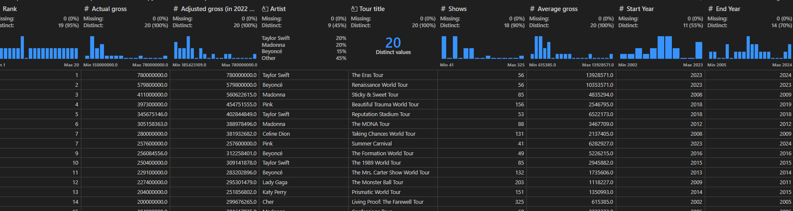
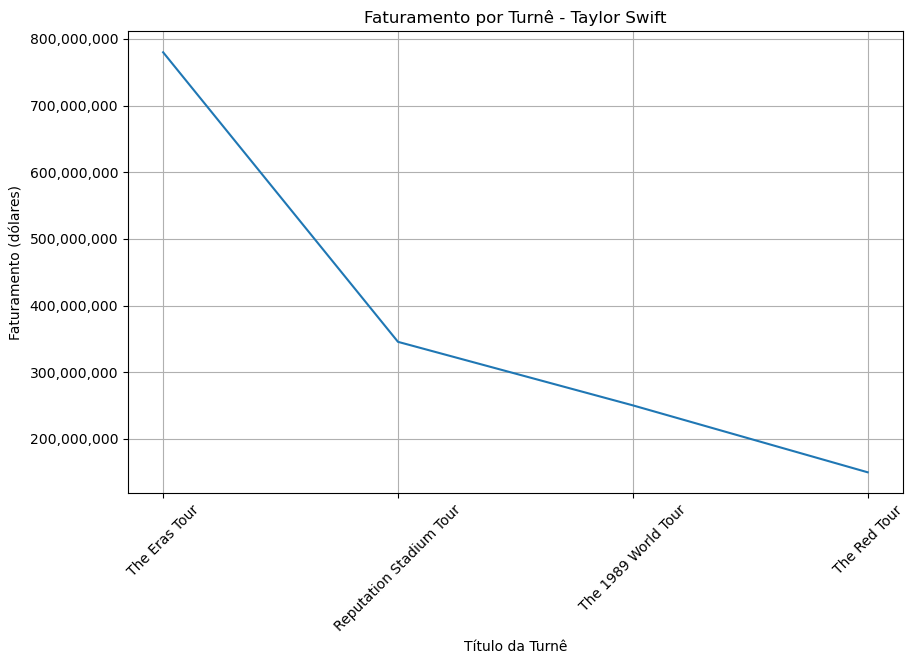
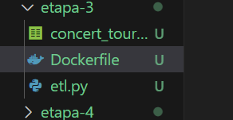
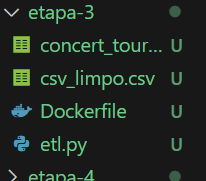
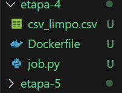
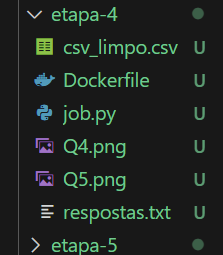
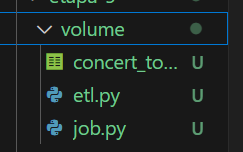
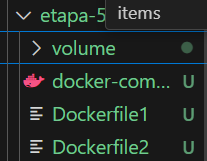
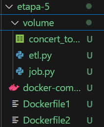
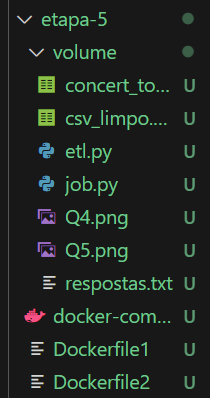

# Etapas

## Etapa 1: Fazer um script em python chamado "etl.py" que fará a limpeza do CSV. O resultado deve ser um arquivo chamado "csv_limpo.csv"

Primeiramente importei a biblioteca Pandas:

    import pandas as pd

Fiz a leitura do arquivo CSV: 

    df = pd.read_csv('concert_tours_by_women.csv')

Tirando as colunas que não é para aparecer no resultado final

    df = df.drop(labels=["Peak", "All Time Peak", "Ref."], axis=1)

Aqui tentei transformar a coluna Year(s) em Start Year e em End Year(s), mas
não tive sucesso.

    df[['Start Year', 'End Year']] = df['Year(s)'].str.split('–', expand = True)

Ao executar o código acima, percebi que deu erro pois tinha dados na coluna
Year(s) que não seguiam o padrão de ter um "ano inicial - ano final", então
as linhas que tem apenas um ano, eu deixo esse ano como inicial e final

    df['Year(s)'] = df['Year(s)'].str.replace('-', '–', regex=False)

    df['Year(s)'] = df['Year(s)'].apply(lambda x: f"{x}–{x}" if '–' not in str(x) else x)

    df[['Start Year', 'End Year']] = df['Year(s)'].str.split('–', expand=True)

Como agora não preciso mais da coluna Year(s), vou deletar essa coluna

    df = df.drop('Year(s)', axis=1)

Como percebi olhando o dataframe que a coluna Actual gross e Average gross
tinham caracteres como "$" e "," e além desses "[ a ]" e "[ b ]"
que atrapalhariam a análise, acabei tirando-os e transformei essas colunas
em float.

    df.loc[df['Actual gross'] == '$229,100,000[b]', 'Actual gross'] = '$229,100,000'
    df.loc[df['Actual gross'] == '$167,700,000[e]', 'Actual gross'] = '$167,700,000'

    df['Actual gross'] = df['Actual gross'].replace({'\\$': '', ',': ''}, regex=True).astype(float)
    df['Adjusted gross (in 2022 dollars)'] = df['Adjusted gross (in 2022 dollars)'].replace({'\\$': '', ',': ''}, regex=True).astype(float)
    df['Average gross'] = df['Average gross'].replace({'\\$': '', ',': ''}, regex=True).astype(float)

Depois de tratar as colunas que envolviam dinheiro, observei que teve
alguns caracteres diferentes que estavam na coluna de Tour title, como eram
poucas linhas acabei modificando diretamente na linha os caracteres
diferentes

    df.loc[df['Tour title'] == 'The Eras Tour †', 'Tour title'] = 'The Eras Tour'
    df.loc[df['Tour title'] == 'Sticky & Sweet Tour ‡[4][a]', 'Tour title'] = 'Sticky & Sweet Tour'
    df.loc[df['Tour title'] == 'Summer Carnival †', 'Tour title'] = 'Summer Carnival'
    df.loc[df['Tour title'] == 'The Monster Ball Tour *', 'Tour title'] = 'The Monster Ball Tour'
    df.loc[df['Tour title'] == 'Living Proof: The Farewell Tour ‡[21][a]', 'Tour title'] = 'Living Proof: The Farewell Tour'

Exportando o dataframe para um arquivo CSV

    df.to_csv('csv_limpo.csv', index=False)

Tive sucesso ao observar que o arquivo CSV ficou igual ao solicitado:

## Etapa 2: Criar um script python chamado "job.py" que fará o processamento dos dados e responderá as questões a seguir

Importando as bibliotecas Pandas e Matplotlib e logo fazendo a leitura do arquivo CSV

    import pandas as pd
    import matplotlib.pyplot as plt

    df = pd.read_csv('csv_limpo.csv')

#### Questões:

#### Q1 - Qual é a artista que mais aparece nessa lista e possui a maior média de seu faturamento bruto (Actual gross)?

Agrupando a media da coluna "Actual gross" pela coluna "Artist":

    media = df.groupby('Artist')['Actual gross'].mean()

Fazendo a contagem de aparições de cada artista:

    cont = df['Artist'].value_counts()

Descobrindo qual artista aparece mais e qual artista teve a maior média de faturamento bruto:

    cont_max = cont.idxmax()
    gross_max = media.idxmax()

Aplicando condição para caso tenha artistas diferentes no "cont_max" e "gross_max" e armazenando a resposta no arquivo txt:

    with open("respostas.txt", "a") as arquivo:
        arquivo.write("Q1:\n")
        if gross_max == cont_max:
            arquivo.write(f"--- A artista que aparece mais vezes e tem a maior media de faturamento: {gross_max}\n\n")
        else:
            arquivo.write(f"--- As artistas diferem:\n"
                        f"--- Artista com maior média de faturamento: {gross_max}\n"
                        f"--- Artista que aparece mais vezes: {cont_max}\n\n")

#### Q2 - Das turnês que aconteceram em um ano, apresente a turnê com a maior média de faturamento bruto (Average gross).

Descobrindo quais turnês duraram apenas um ano: 

    um_ano = df[df['Start Year'] == df['End Year']]

Descobrindo quais das turnês que duraram apenas um ano ficaram com a maior média de faturamento bruto:

    avg_gross = um_ano[['Tour title', 'Average gross']].sort_values('Average gross', ascending=False).head(1)

    with open("respostas.txt", "a") as arquivo:
        arquivo.write("Q2:\n")
        arquivo.write(f"--- Das tours que aconteceram em um ano, a tour com a maior media de faturamento bruto: {avg_gross['Tour title'].values[0]}\n\n")

#### Q3 - Quais são as 3 artistas que mais lucraram com menos número de shows? Cite também o nome da turnê de cada artista. Utilize a coluna "Adjusted gross (in 2022 dollars)".

Atribuí a um dataframe auxiliar as colunas que eu gostaria de utilizar e nesse dataframe criei uma coluna "Lucro_por_show" que recebe a média de quanto foi lucrado por cada show de cada turnê. E depois eu descobri qual era o maior lucro de cada artista e armazenei em um novo dataframe chamado "maiores_lucros":

    df_aux = df[['Artist', 'Adjusted gross (in 2022 dollars)', 'Shows', 'Tour title']]
    df_aux['Lucro_por_show'] = df_aux['Adjusted gross (in 2022 dollars)'] / df_aux['Shows']

    maiores_lucros = df_aux.loc[df_aux.groupby("Artist")["Lucro_por_show"].idxmax()][['Lucro_por_show', 'Artist', 'Tour title']]

Agora eu criei um dataframe que tivesse as turnês de cada artista com menor número de shows para depois descobrir se uma dessas turnês estão listadas no dataframe das turnês com maiores lucros

    menor_shows = df.loc[df.groupby("Artist")["Shows"].idxmin()][['Artist', 'Tour title', 'Shows']]

Agora fiz a junção entre os dois DataFrames (menor_shows e maiores_lucros) usando as colunas "Artist" e "Tour title" como chave.
Apenas as turnês que aparecem em ambos os DataFrames serão mantidas no resultado:

    resultado = pd.merge(menor_shows, maiores_lucros, on=["Artist", "Tour title"])

    # Mostrei as turnês que atendem aos dois critérios
    resultado_final = resultado.sort_values("Lucro_por_show", ascending=False).head(3)[['Artist', 'Tour title']]

    with open("respostas.txt", "a") as arquivo:
        arquivo.write("Q3:\n")
        arquivo.write('--- As 3 artistas que mais lucraram com menos quantidade de shows:\n')
        for index, i in resultado_final.iterrows():
            arquivo.write(f"--- Artista: {i['Artist']}, Tour: {i['Tour title']}\n")
        arquivo.write("\n")

#### Q4 - Para a artista que mais aparece nessa lista e que tenha o maior somatório de faturamento bruto, crie um gráfico de linhas que mostra o faturamento por ano da turnê (use a coluna Start Year).

Fui descobrir qual era a artista que tinha o maior faturamento e frequência na lista:

    # Descobri qual artista aparece mais vezes
    frequente = df['Artist'].value_counts().idxmax()

    # Descobri qual artista tem o maior faturamento total
    faturamento_total = df.groupby('Artist')['Actual gross'].sum()
    maior_faturamento = faturamento_total.idxmax()

Como não possui o valor exato do faturamento anual de cada turnê, fiz um gráfico que mostre o faturamento de cada turnê da artista:

    import matplotlib.ticker as ticker
    # Utilizei a biblioteca Matplotlib.ticker para criar o gráfico e formatar o
    # eixo y para exibir valores sem notação científica.

    # Atribuindo a df_artist as informações da artista
    df_artist = df[df['Artist'] == frequente]

    plt.figure(figsize=(10, 6))
    plt.plot(df_artist['Tour title'], df_artist['Actual gross'])
    plt.xlabel('Título da Turnê')
    plt.ylabel('Faturamento (dólares)')
    plt.title(f'Faturamento por Turnê - {frequente}')
    plt.xticks(rotation=45)
    plt.grid(True)

    # Desativando a notação científica no eixo y
    plt.gca().yaxis.set_major_formatter(ticker.ScalarFormatter(useOffset=False))
    plt.gca().yaxis.set_major_formatter(ticker.FuncFormatter(lambda x, _: f'{x:,.0f}'))

    # Salvando o gráfico como imagem PNG
    plt.savefig('Q4.png')

    plt.show()

Gráfico: 

#### Q5 - Faça um gráfico de colunas demonstrando as 5 artistas com mais shows na lista.

Agrupei por artista e somei o número de shows:

    artist_shows = df.groupby('Artist')['Shows'].sum()

    top5 = artist_shows.sort_values(ascending=False).head(5)

Criei o gráfico de colunas:

    plt.figure(figsize=(10, 6))
    top5.plot(kind='bar', color='skyblue')
    plt.xlabel('Artista')
    plt.ylabel('Número de Shows')
    plt.title('Top 5 Artistas com Mais Shows')
    plt.xticks(rotation=45)
    plt.grid(axis='y')

    # Salvando o gráfico como imagem PNG
    plt.savefig('Q5.png')

    plt.show()

Gráfico:

Resultados da questão 1, 2 e 3 (respostas geradas no arquivo "respostas.txt"):

    Q1:
    --- A artista que aparece mais vezes e tem a maior media de faturamento: Taylor Swift

    Q2:
    --- Das tours que aconteceram em um ano, a tour com a maior media de faturamento bruto: Renaissance World Tour

    Q3:
    --- As 3 artistas que mais lucraram com menos quantidade de shows:
    --- Artista: Pink, Tour: Summer Carnival
    --- Artista: Celine Dion, Tour: Taking Chances World Tour
    --- Artista: Lady Gaga, Tour: Born This Way Ball

## Etapa 3: Crie um documento no formato "Dockerfile" que execute o script criado na etapa 1

Criei o documento "Dockerfile" na pasta "etapa-3" junto com os arquivos necessários como o "etl.py" e "concert_tours_by_women.csv" e produzi o seguinte script para executar o script python: 

Base image oficial do Python, versão 3:

    FROM python:3

Defini o diretório de trabalho dentro do container como "/app":

    WORKDIR /app

Copiei todos os arquivos do diretório atual para o diretório de trabalho do container:

    COPY . /app

Instalei a biblioteca Pandas, necessária para o script Python:

    RUN pip install pandas

Defini o comando a ser executado quando o container for iniciado:

    CMD ["python", "etl.py"]

No terminal executei esse comando para construir a imagem que denominei "etl-python":

    docker build -t etl-python .  

Depois, digitei este comando para criar um container e executar o script python:

    docker run --rm -v "/c/Users/isabe/Documents/Compass UOL/Sprint 3/Desafio/etapa-3:/app" etl-python

Diretório antes da execução do script:

Diretório depois da execução do script:

## Etapa 4: Crie um documento no formato "Dockerfile" que execute o script criado na etapa 2

Criei o documento "Dockerfile" na pasta "etapa-4" junto com os arquivos necessários como o "job.py" e "csv_limpo.csv" e produzi o seguinte script para executar o script python: 

Utilizei a imagem base oficial do Python (versão 3):

    FROM python:3

Defini o diretório de trabalho dentro do container como "/app" e todos os comandos subsequentes irão considerar este diretório como base:

    WORKDIR /app

Copiei todos os arquivos do diretório atual para o diretório de trabalho do container, isso inclui o script "job.py" e quaisquer arquivos adicionais necessários:

    COPY . /app

Instalei as bibliotecas Python necessárias para o script:
Pandas: para manipulação e análise de dados.
Matplotlib: para criação de gráficos e visualização de dados.

    RUN pip install pandas && pip install matplotlib

Defini o comando padrão que será executado quando o container for iniciado.

    CMD ["python", "job.py"]

No terminal executei esse comando para construir a imagem que denominei "job-python":

    docker build -t job-python .  

Depois, digitei este comando para criar um container e executar o script python:

    docker run --rm -v "/c/Users/isabe/Documents/Compass UOL/Sprint 3/Desafio/etapa-4:/app" job-python

Diretório antes da execução do script:

Diretório depois da execução do script:

## Etapa 5: 

Coloquei os seguintes arquivos na pasta volume para os scripts python serem executados:

E na raiz deixei o Dockerfile da etapa 3 e o dockerfile da etapa 4 juntos com o arquivo "docker-compose.yml"

No script do "docker-compose.yml":

Defini a versão do Docker Compose:

    version: '3.8'

Defini os serviços que serão gerenciados pelo Docker Compose.
Primeiro serviço chamado "script1", responsável por executar o script "etl.py".

    services:
  
        script1:

Configuração de build para o container:

"context": Diretório raiz usado como base para o build.

"dockerfile": Nome do Dockerfile usado para criar a imagem (neste caso, "Dockerfile1").

    build:
      context: .
      dockerfile: Dockerfile1
    
Monta um volume local na pasta "/app" dentro do container:

"./volume": Diretório local.

"/app": Diretório no container.

    volumes:
      - ./volume:/app
    
Comando que será executado ao iniciar o container. Neste caso, o script Python "etl.py".

O script gerará um arquivo chamado "csv_limpo.csv", que será usado pelo próximo serviço.

    command: python /app/etl.py

Segundo serviço chamado "script2", responsável por executar o script "job.py".

    script2:

Configuração de build, semelhante ao serviço "script1", mas utilizando o "Dockerfile2".

    build:
      context: .
      dockerfile: Dockerfile2
    
Monta o mesmo volume do primeiro serviço, permitindo o compartilhamento de dados entre os dois scripts.

    volumes:
      - ./volume:/app
    
Define que o serviço "script2" só será iniciado após o término do serviço "script1".
Pois o script "job.py" depende do arquivo "csv_limpo.csv" gerado pelo script "etl.py".

    depends_on:
      - script1
    
Comando que será executado ao iniciar o container. Neste caso, o script Python "job.py".
Ele processará o arquivo "csv_limpo.csv" criado pelo script "etl.py".

    command: python /app/job.py

No terminal usarei esse comando para criar e iniciar todos os serviços definidos no arquivo "docker-compose.yml":

    docker-compose up --build   

Diretório antes da execução do script:

Diretório depois da execução do script:

