# Desafio

## Base de dados escolhida: Óbitos por Doenças Crônicas Não Transmissíveis (DCNT) em 2023

## AWS CLI

Instalação:

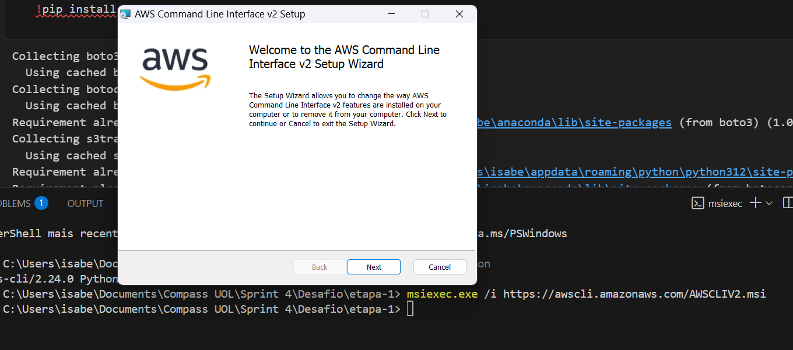

Verificando se o AWS CLI foi baixado:

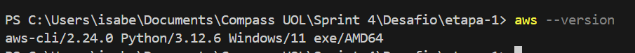

## Autenticação SSO

Criando nome da sessão SSO:

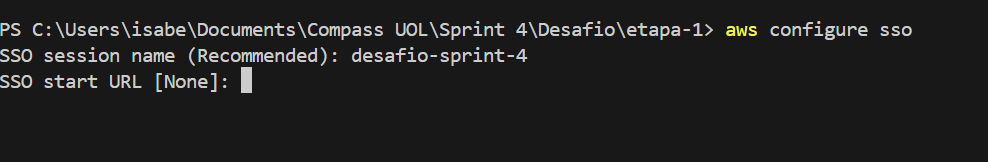

Verificando as credenciais no site da AWS na parte "Chaves de acesso" para preencher no terminal:

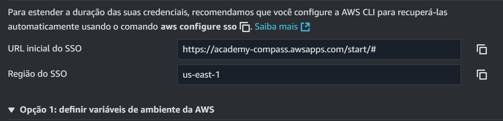

Após o preenchimento das credenciais o request foi aprovado:

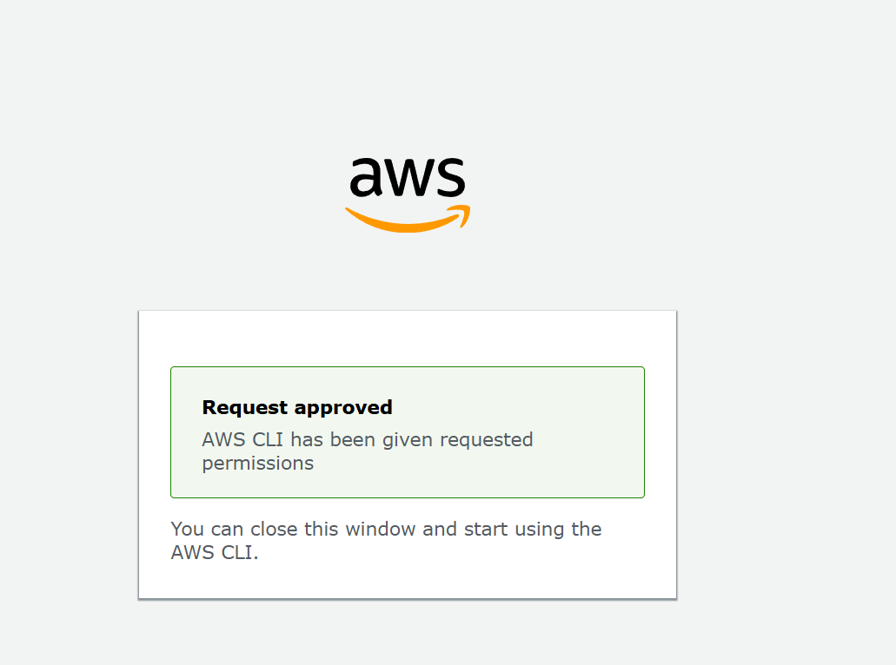

Autenticação foi realizada com sucesso:

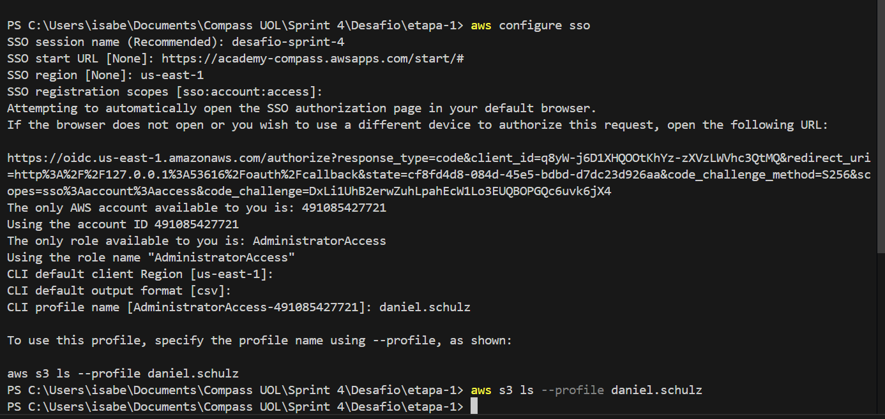


## Introdução

Fiz uma análise de dados envolvendo Doenças Crônicas Não Transmissíveis (DCNT) em 2023. Meu objetivo foi explorar e processar os dados, utilizando Python e serviços da AWS para armazenamento e manipulação dos arquivos.

O desafio foi dividido em duas etapas:
1. **Análise inicial dos dados e upload para um bucket no Amazon S3**
2. **Leitura dos dados diretamente do S3, criação de um dataframe e execução das análises definidas**

## Etapa 1 - Análise Inicial e Upload para o S3

Primeiramente, analisei os dados localmente usando um editor de texto para entender melhor a estrutura e definir
quais insights poderia extrair. Optei por investigar:
- A distribuição de óbitos por cor/raça.
- A classificação dos óbitos por faixa etária.
- A sazonalidade dos óbitos por mês.

Os dados foram extraídos do Sistema de Informação sobre Mortalidade (SIM) através do Tabnet da Secretaria de Estado de Saúde de Minas Gerais (SES-MG). A base de dados já estava bem estruturada, o que facilitou a análise.

### Instalação do boto3

O boto3 é a biblioteca oficial da AWS para interagir com os serviços da nuvem. Para enviar o arquivo ao S3, instalei a dependência com o seguinte comando:
```bash
!pip install boto3
```
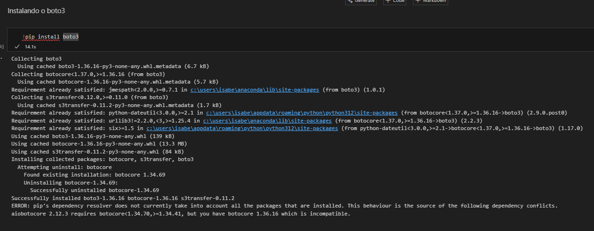

### Código para Upload no S3

Para começar, importei as bibliotecas necessárias e li o arquivo CSV com os dados:
```python
import pandas as pd
import boto3
from io import StringIO

df = pd.read_csv('dados_cronicas_ses_2023.csv', sep=';')
```

Agora, configurei a sessão do boto3 utilizando o perfil do SSO configurado anteriormente:
```python
session = boto3.Session(profile_name="daniel.schulz")
s3 = session.client("s3")
```

Em seguida, defini o nome do bucket e criei ele no S3:
```python
bucket_name = "daniel.schulz"
s3.create_bucket(Bucket=bucket_name)
print(f"Bucket {bucket_name} criado com sucesso!")
```

Converti o DataFrame para um formato adequado para upload:
```python
csv_buffer = StringIO()
df.to_csv(csv_buffer, index=False)
```

E por fim, fiz o upload do arquivo para o bucket no S3:
```python
s3.put_object(Bucket=bucket_name, Key="dados_cronicas_obitos.csv", Body=csv_buffer.getvalue())
print(f"Arquivo CSV enviado para o bucket {bucket_name}")
```


Executando o bloco de código:

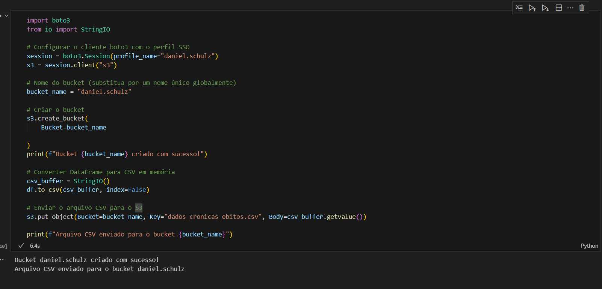

Verificando se o bucket está no S3:

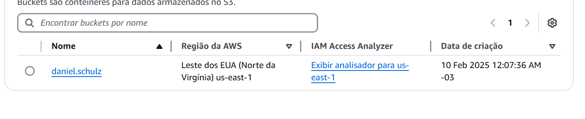

Verificando se o arquivo está no bucket:

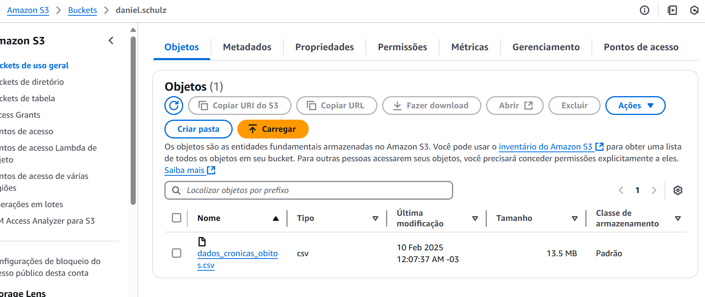

## Etapa 2 - Leitura e Análise dos Dados no S3

Agora, precisei carregar os dados diretamente do S3 e realizar as análises. Para isso, escolhi a biblioteca **s3fs**, que facilita a leitura de arquivos no S3 como se fossem locais.

### Instalação do s3fs

O `s3fs` permite acessar buckets do S3 diretamente como um sistema de arquivos:
```bash
!pip install s3fs
```

Instalando s3fs:

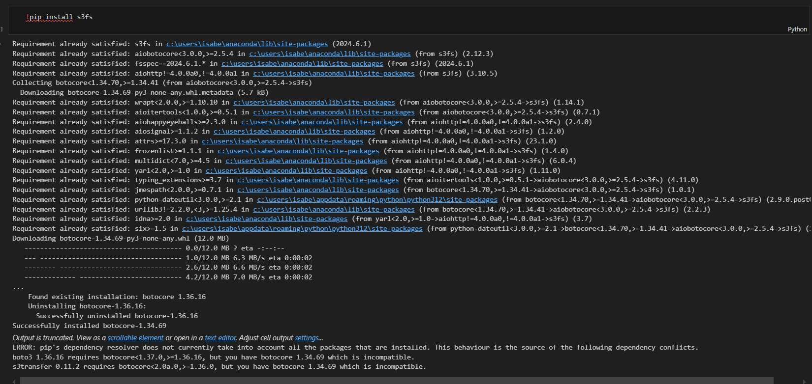


### Leitura dos dados

Para acessar os arquivos no S3, utilizei o `s3fs` da seguinte forma:
```python
import s3fs
fs = s3fs.S3FileSystem()
df = pd.read_csv('s3://daniel.schulz/dados_cronicas_obitos.csv', storage_options={'anon': False, 'profile': 'daniel.schulz'})
```


### Análises

1. **Distribuição de óbitos por raça/cor:**
```python
distribuicao_raca_cor = df['tp_raca_cor'].value_counts()
porcentagem_raca_cor = (distribuicao_raca_cor / distribuicao_raca_cor.sum()) * 100
print("Distribuição de óbitos por raça/cor em 2023:")
print(distribuicao_raca_cor)
print("\nPorcentagem de cada grupo:")
print(porcentagem_raca_cor.round(2))
```

```df['tp_raca_cor'].value_counts()```: Conta o número de ocorrências de cada categoria na coluna 'tp_raca_cor' do DataFrame df.

```porcentagem_raca_cor = (distribuicao_raca_cor / distribuicao_raca_cor.sum()) * 100```: Calcula a porcentagem de cada categoria dividindo o número de ocorrências pelo total e multiplicando por 100.

Execução:

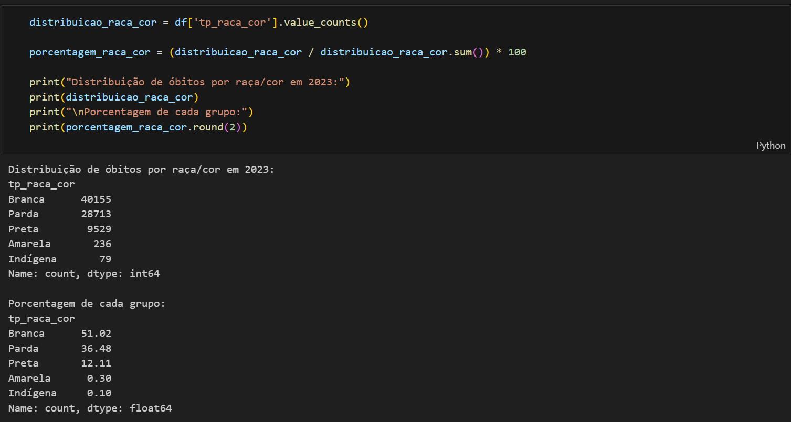

2. **Classificação de óbitos por faixa etária:**
```python
def classificar_idade(idade):
    if idade <= 18:
        return '0-18'
    elif 19 <= idade <= 40:
        return '19-40'
    elif 41 <= idade <= 60:
        return '41-60'
    else:
        return '61+'

df['Faixa_Etaria'] = df['nu_idade'].apply(classificar_idade)
distribuicao_faixa_etaria = df['Faixa_Etaria'].value_counts()
print("Distribuição de óbitos por faixa etária em 2023:")
print(distribuicao_faixa_etaria)
```
```def classificar_idade(idade): ...```: Define uma função que classifica a idade em faixas etárias.

```df['nu_idade'].apply(classificar_idade)```: Aplica a função classificar_idade a cada valor na coluna 'nu_idade' e cria uma nova coluna 'Faixa_Etaria' com os resultados.

```df['Faixa_Etaria'].value_counts()```: Conta o número de ocorrências de cada faixa etária.

Execução:

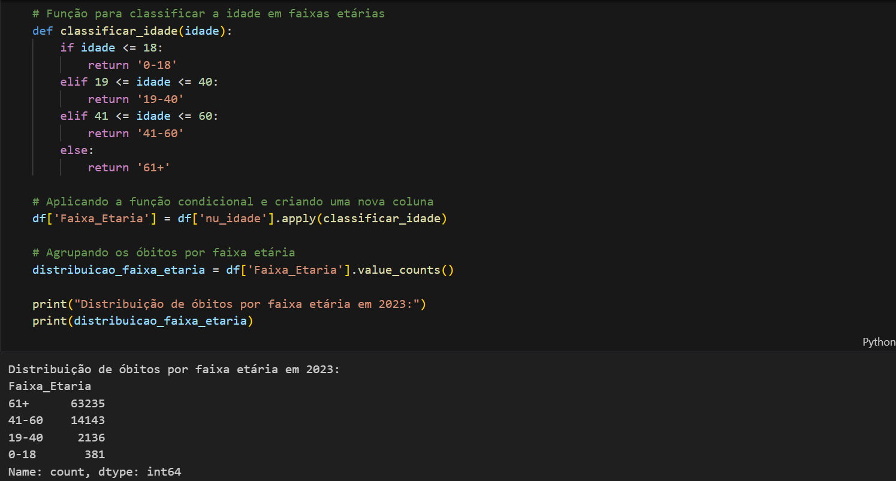

3. **Identificação do mês com mais óbitos:**
```python
df['Mes'] = df['dt_obito'].str[3:5]
obitos_por_mes = df['Mes'].value_counts()
mes_maior_obitos = obitos_por_mes.idxmax()
total_obitos_mes = obitos_por_mes.max()
media_diaria = total_obitos_mes / 31

print("Mês com maior número de óbitos em 2023:", mes_maior_obitos)
print("Total de óbitos no mês:", total_obitos_mes)
print("Média diária de óbitos no mês:", round(media_diaria, 2))
```

```df['dt_obito'].str[3:5]```: Extrai o mês da data de óbito (assumindo que a data está no formato 'dd/mm/yyyy') e cria uma nova coluna 'Mes'.

```df['Mes'].value_counts()```: Conta o número de óbitos em cada mês.

```obitos_por_mes.idxmax()```: Identifica o mês com o maior número de óbitos.

```obitos_por_mes.max()```: Obtém o total de óbitos no mês com mais óbitos.

```total_obitos_mes / 31```: Calcula a média diária de óbitos no mês.

Execução:

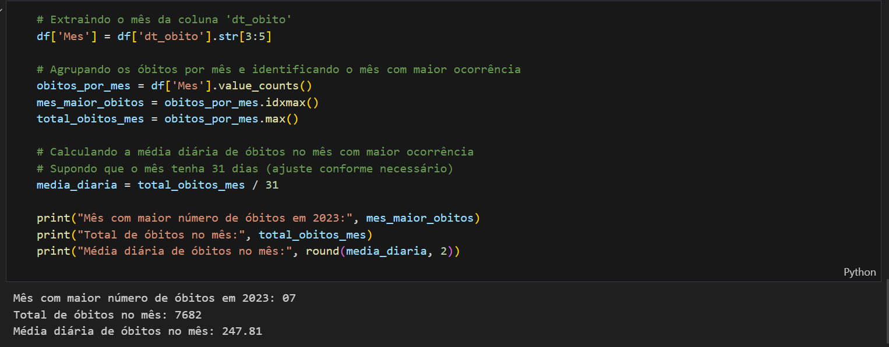

## Conclusão

Concluí com sucesso as duas etapas do desafio, explorando os dados de mortalidade por DCNT em 2023. A escolha do **s3fs** foi essencial, pois simplificou a leitura do arquivo no S3 sem necessidade de downloads, tornando o processo mais eficiente. As análises fornecem insights interessantes sobre mortalidade por faixa etária, cor/raça e sazonalidade, podendo auxiliar na formulação de políticas públicas.

