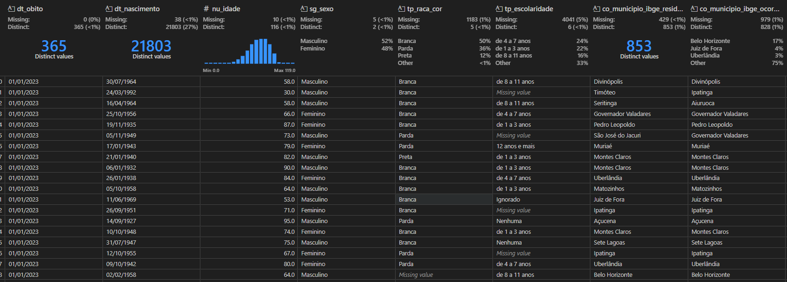
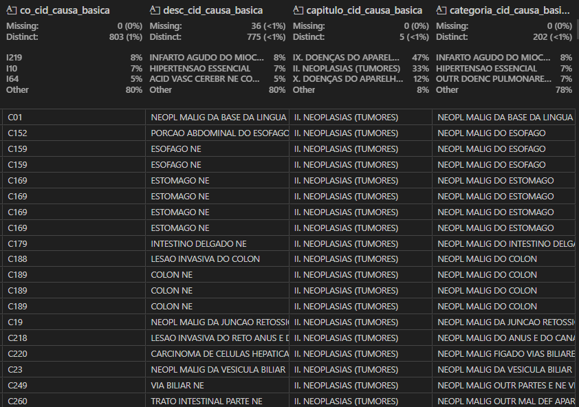

# Análise de Óbitos por Doenças Crônicas Não Transmissíveis (DCNT) em 2023

## Introdução

Apresento uma análise detalhada dos óbitos registrados em 2023 devido a Doenças Crônicas Não Transmissíveis (DCNT). Os dados foram extraídos do Sistema de Informação sobre Mortalidade (SIM) através do Tabnet da Secretaria de Estado de Saúde de Minas Gerais (SES-MG).

É importante destacar que não foi necessário realizar qualquer tipo de tratamento nos dados do CSV, pois a base já estava bem formatada e estruturada. Isso facilitou a análise e permitiu que eu me concentrasse na extração de insights.

As DCNT representam um dos principais desafios da saúde pública devido à sua alta prevalência e ao impacto significativo na expectativa de vida da população. Dentro desse contexto, meu objetivo é compreender padrões de mortalidade a partir da distribuição dos óbitos por diferentes categorias, como cor/raça, faixa etária e sazonalidade mensal.

## Descrição da Base de Dados

O banco de dados utilizado é composto por registros de óbitos categorizados conforme a Classificação Internacional de Doenças (CID-10), abrangendo os seguintes grupos:

- **C00 - C97:** Neoplasias (tumores malignos)
- **E10 - E14:** Diabetes
- **I00 - I99:** Doenças cardiovasculares
- **J30 - J98:** Doenças respiratórias crônicas

O conjunto de dados inclui informações sobre a data do óbito, idade, sexo, cor/raça, escolaridade, município de residência e município de ocorrência, bem como a causa básica do óbito.

## Análises a Serem Realizadas

### 1 - Distribuição de Óbitos por Cor/Raça

Será realizada uma análise para compreender a relação entre os óbitos e a cor/raça dos falecidos. Os registros serão agrupados conforme a classificação da coluna `tp_raca_cor`, e também será calculada a porcentagem de cada grupo em relação ao total de óbitos.

Essa análise permitirá identificar possíveis disparidades entre diferentes grupos raciais.

### 2 - Classificação de Óbitos por Faixa Etária

Os óbitos serão segmentados em categorias etárias com base na coluna `nu_idade`, seguindo a seguinte distribuição:

- **0-18 anos**
- **19-40 anos**
- **41-60 anos**
- **61+ anos**

Com essa segmentação, será possível visualizar quais faixas etárias são mais impactadas pelas DCNT.

### 3 - Identificação do Mês com Maior Número de Óbitos

Para analisar a sazonalidade dos óbitos, será extraído o mês da coluna `dt_obito`, e os dados serão agrupados por período do ano. Será identificado o mês com maior incidência de óbitos, além de calcular a média diária de falecimentos nesse período.

## Conclusão Esperada

Ao finalizar essas análises, espera-se obter um entendimento mais aprofundado sobre a mortalidade por DCNT em 2023. Os insights gerados podem ser úteis para auxiliar na formulação de políticas de saúde mais eficazes, além de contribuir para a identificação de padrões relevantes na distribuição racial, etária e sazonal dos óbitos.

