# Desafio de Análise de Séries de Guerra e Ingestão de Dados para Data Lake

## Descrição do Desafio

Este desafio consiste em realizar a análise de séries de guerra, utilizando dados coletados de duas fontes principais: um arquivo JSON com informações extraídas do TMDB e arquivos CSV contendo dados de filmes e séries. Além disso, também será feito um processo de ingestão de dados para um Data Lake utilizando AWS S3. O objetivo é carregar os dados, manter a organização e realizar análises detalhadas de séries de guerra. O processo é dividido em duas etapas principais:

1. **Etapa 1: Definição de Análises e Envio de Arquivos para o Bucket do S3**
   - A primeira etapa consiste em definir as análises que serão realizadas e enviar dois arquivos CSV (contendo dados de filmes e séries) para o bucket do Amazon S3, na camada "Raw". Esses arquivos servirão de base para as análises posteriores.

2. **Etapa 2: Processamento dos Dados do TMDB**
   - Na segunda etapa, será criado um código Python para extrair dados do TMDB (via API), realizando o processamento necessário para incluir informações adicionais sobre as séries de guerra e armazenando esses dados de maneira estruturada para análises futuras.

### Análises Planejadas

1. **Distribuição de Notas IMDb das Séries de Guerra**
   - Avaliação das séries de guerra com base na média de notas IMDb ao longo do tempo.

2. **Tendência de Lançamentos de Séries de Guerra**
   - Investigação do número de séries de guerra lançadas ao longo do tempo, observando possíveis aumentos ou quedas na produção.

3. **Relação Entre Nota IMDb e Número de Votos**
   - Análise da correlação entre o número de votos e a nota média das séries de guerra.

4. **Análise de Status das Séries de Guerra**
   - Investigação sobre o status das séries (cancelada, em andamento, finalizada) e sua relação com a avaliação crítica.

5. **Atuação dos Atores em Séries de Guerra**
   - Identificação dos atores mais presentes nas séries de guerra e análise de sua relação com o sucesso da série.

6. **Comparação de Estúdios no Gênero Guerra**
   - Comparação dos estúdios responsáveis pelas séries de guerra, analisando se o estúdio tem impacto na popularidade e avaliação das produções.

7. **Análise de Séries de Guerra por Estúdio e Ano de Lançamento**
   - Análise da produção de séries de guerra por estúdio e evolução ao longo dos anos.

---

## Etapa 1: Ingestão de Dados em Batch (Arquivos CSV)

### Objetivo da Etapa

O objetivo da Etapa 1 é fazer o upload de dois arquivos CSV, contendo informações de filmes e séries, para o Amazon S3, dentro da RAW Zone do Data Lake. O código Python será executado em um container Docker, e a biblioteca `boto3` será usada para carregar os dados para o S3.


#### Bucket do Datalake criado

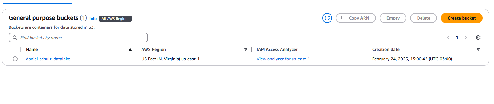

### Passos Realizados

#### 1.1. Download dos Arquivos Necessários
- O arquivo `Filmes e Series.zip` foi baixado e descompactado, resultando nos arquivos `movies.csv` e `series.csv`.

#### 1.2. Código Python para Ingestão dos Arquivos

- Foi implementado um código Python para ler os arquivos CSV sem filtrar os dados, utilizando `pandas` para o processamento.
- A biblioteca `boto3` foi configurada para fazer a interação com o AWS S3, e os dados foram gravados na RAW Zone do Data Lake.

```python
import boto3
import pandas as pd
from datetime import datetime

# Carregar os dados dos arquivos CSV
movies_df = pd.read_csv('movies.csv')
series_df = pd.read_csv('series.csv')

# Definir o cliente S3
s3 = boto3.client('s3')

# Nome do bucket do S3
bucket_name = 'data-lake-do-fulano'

# Padrão de caminho para os arquivos
date_str = datetime.now().strftime("%Y/%m/%d")

# Carregar os dados para o S3
s3.put_object(Bucket=bucket_name, Key=f'Raw/Local/CSV/Movies/{date_str}/movies.csv', Body=movies_df.to_csv(index=False))
s3.put_object(Bucket=bucket_name, Key=f'Raw/Local/CSV/Series/{date_str}/series.csv', Body=series_df.to_csv(index=False))
```

### 1.3. Estrutura de Armazenamento no S3

Os arquivos foram armazenados no S3 com o seguinte padrão de nomeação:

    S3://data-lake-do-fulano/Raw/Local/CSV/Movies/2024/05/02/movies.csv 

    S3://data-lake-do-fulano/Raw/Local/CSV/Series/2024/05/02/series.csv


---

### 1.4. Dockerfile para Execução Local

Um container Docker foi criado para executar o código Python de ingestão dos arquivos. O Dockerfile para a criação do container está abaixo:

```dockerfile
FROM python:3.9-slim

WORKDIR /app

COPY . /app

RUN pip install boto3

RUN mkdir -p /app/data

COPY movies.csv series.csv /app/data/

VOLUME /app/data

CMD ["python", "etapa1.py"]
```

### 1.5. Execução Local do Docker

O código foi executado localmente em um container Docker para realizar a carga dos dados no S3. Os arquivos CSV foram carregados com sucesso na RAW Zone do Data Lake.

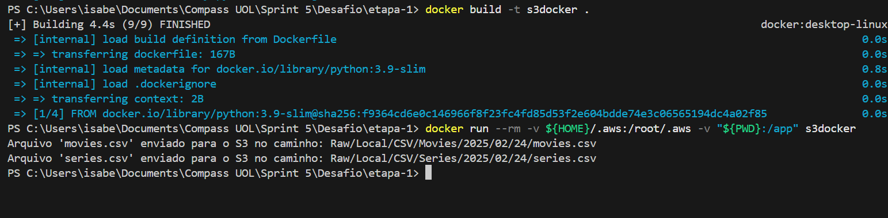

Arquivos no S3:

series.csv:

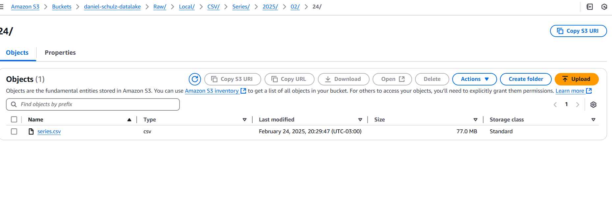

movies.csv:

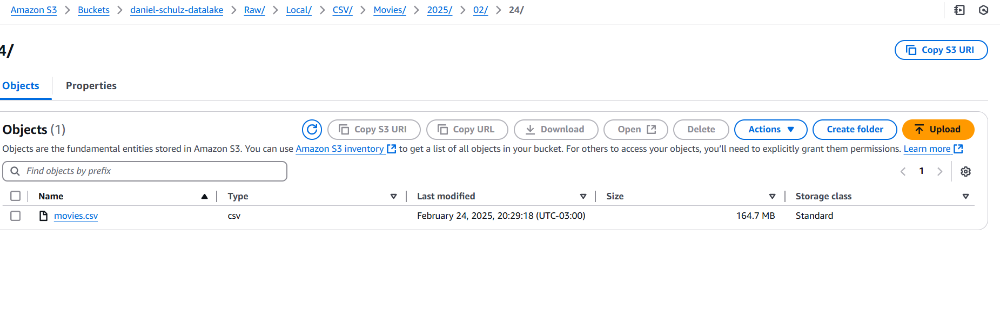


---


## **Etapa 2: Processamento dos Dados do TMDB**

### **Objetivo da Etapa**

O objetivo desta etapa é obter dados adicionais das séries de guerra diretamente da API do TMDB. Esse processo permitirá enriquecer as informações contidas no dataset original, adicionando dados como **estúdio, número de episódios, nota IMDb e status atual da série**.

Os dados processados serão armazenados no formato **JSON** na camada **Raw** do Data Lake no S3.

---

## Configurações na AWS

Desativei o bloqueio do acesso público no bucket

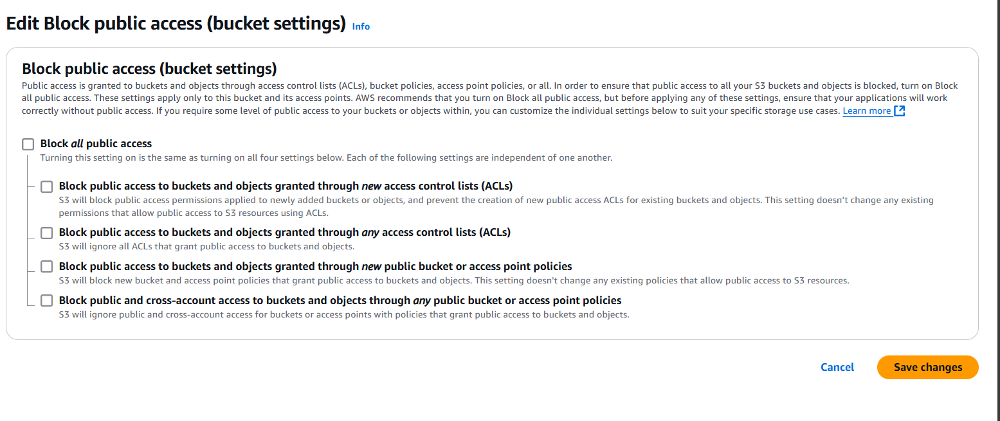

Criei uma role com política de permissão para poder acessar o S3 com o Lambda

Adicionando política a role 

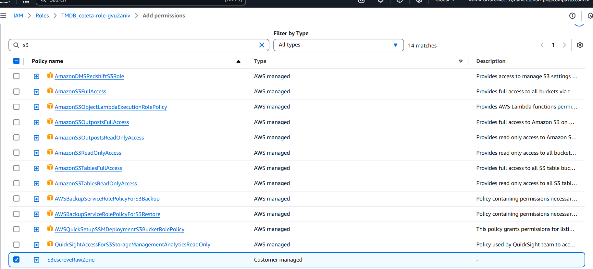

Política adicionada

Depois precisei criar a função lambda, coloquei time out máximo e coloquei a role criada

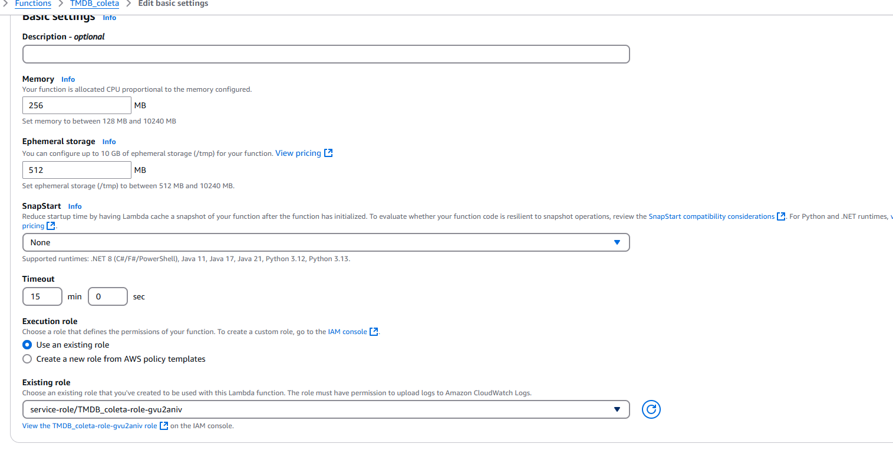

Função Lambda criada

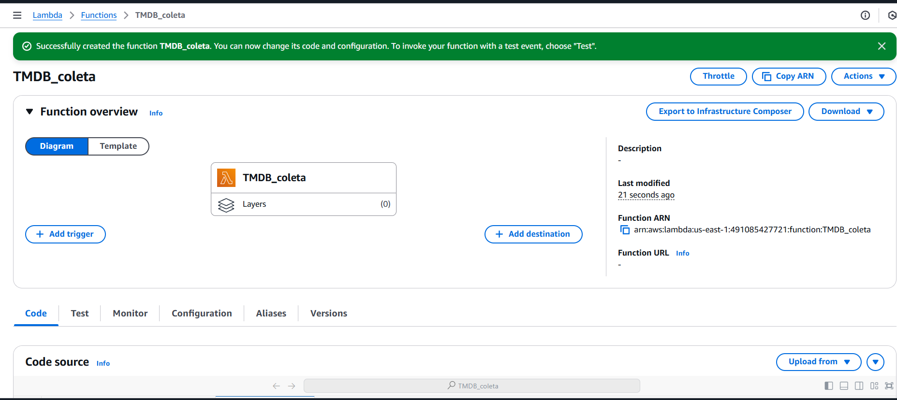


Criando layer com a biblioteca requests para funcionar o código

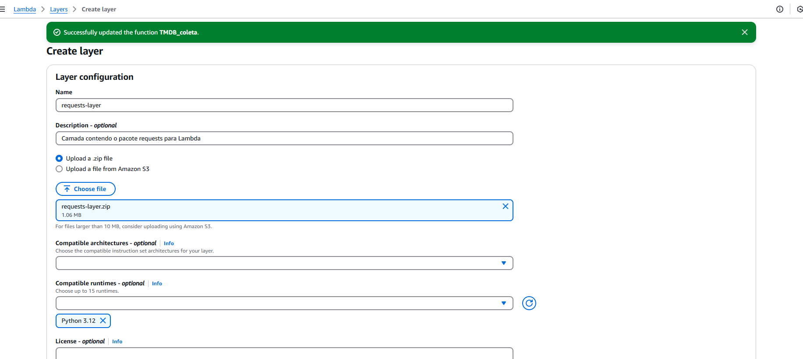

Layer sendo adicionada

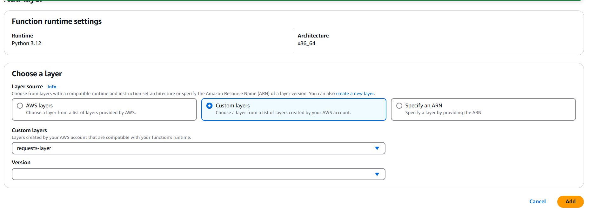


Por último adicionei as variáveis de ambiente para o código funcionar

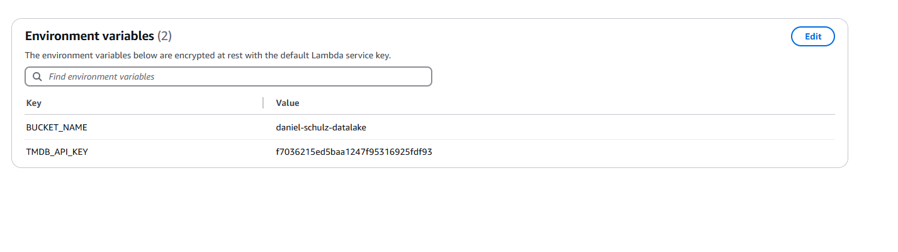
## **Passos Realizados no código**

### **2.1. Configuração da Chave da API do TMDB**

Para acessar a API do TMDB, é necessário utilizar uma **chave de API**. No código, essa chave será armazenada de forma segura, utilizando **variáveis de ambiente**, para evitar exposição de credenciais.

```python
import json
import os
import boto3
import requests
from datetime import datetime
from concurrent.futures import ThreadPoolExecutor, as_completed

API_KEY = os.getenv("TMDB_API_KEY")  
BUCKET_NAME = os.getenv("BUCKET_NAME")  
BASE_URL = "https://api.themoviedb.org/3"

s3 = boto3.client("s3")

ORIGEM_DADO = "Raw"
ESPECIFICACAO_DADO = "TMDB"
FORMATO_DADO = "JSON"
DATA_PROCESSAMENTO = datetime.now().strftime("%Y/%m/%d")
```

---

### **2.2. Função para Buscar Detalhes das Séries no TMDB**

A API do TMDB permite buscar séries pelo **ID do TMDB** e obter detalhes como estúdio, popularidade e número de episódios.

```python
def get_series_details(tmdb_id):
    """Busca detalhes de uma série pelo ID no TMDB."""
    url = f"{BASE_URL}/tv/{tmdb_id}"
    params = {"api_key": API_KEY}
    
    try:
        response = requests.get(url, params=params, timeout=5)
        if response.status_code == 200:
            data = response.json()

            estudio = "N/A"
            if "networks" in data and data["networks"]:
                estudio = data["networks"][0].get("name", "N/A")
            elif "production_companies" in data and data["production_companies"]:
                estudio = data["production_companies"][0].get("name", "N/A")

            return {
                "id": data.get("id"),
                "tituloOriginal": data.get("name"),
                "anoLancamento": data.get("first_air_date", "N/A")[:4],
                "imdbRating": data.get("vote_average"),
                "status": data.get("status"),
                "estudio": estudio,
                "numeroEpisodios": data.get("number_of_episodes", "N/A"),
            }
        else:
            print(f"Erro ao buscar ID {tmdb_id}: {response.status_code}")
    except requests.RequestException as e:
        print(f"Erro na requisição {tmdb_id}: {e}")
    
    return None
```

---

### **2.3. Busca de Todas as Séries de Guerra no TMDB**

A função abaixo busca todas as séries pertencentes ao gênero "Guerra" (**ID: 10768**) sem filtro de data ou nota média.

```python
def get_war_series():
    """Busca todas as séries de guerra sem filtro de data ou média de votos."""
    url = f"{BASE_URL}/discover/tv"
    params = {
        "api_key": API_KEY,
        "with_genres": "10768",
        "page": 1
    }

    all_series = []
    while True:
        response = requests.get(url, params=params)
        if response.status_code == 200:
            data = response.json()
            total_pages = data.get("total_pages", 1)

            for page in range(1, total_pages + 1):
                params["page"] = page
                response = requests.get(url, params=params)
                if response.status_code == 200:
                    all_series.extend(response.json().get("results", []))
                else:
                    break
        else:
            print(f"Erro ao buscar séries de guerra: {response.status_code}")
            break

        if len(all_series) < data["total_results"]:
            params["page"] += 1
        else:
            break
    
    return all_series
```

---

### **2.4. Processamento dos Dados e Upload para o S3**

Agora, buscamos os detalhes das séries coletadas e armazenamos os dados processados no Data Lake do S3.

```python
def lambda_handler(event, context):
    """Função principal do AWS Lambda."""
    
    series_data = get_war_series()
    print(f"Total de séries encontradas: {len(series_data)}")

    tmdb_ids = [serie["id"] for serie in series_data]

    detailed_data = []
    with ThreadPoolExecutor(max_workers=20) as executor:
        future_to_id = {executor.submit(get_series_details, tmdb_id): tmdb_id for tmdb_id in tmdb_ids}
        for future in as_completed(future_to_id):
            result = future.result()
            if result:
                detailed_data.append(result)

    file_name = "war_series_all_time.json"
    s3_key = f"{ORIGEM_DADO}/{ESPECIFICACAO_DADO}/{FORMATO_DADO}/{DATA_PROCESSAMENTO}/{file_name}"
    
    s3.put_object(
        Bucket=BUCKET_NAME,
        Key=s3_key,
        Body=json.dumps(detailed_data, ensure_ascii=False, indent=4),
        ContentType="application/json"
    )

    return {
        "statusCode": 200,
        "body": f"Arquivo '{file_name}' salvo no bucket '{BUCKET_NAME}' no caminho '{s3_key}'"
    }
```

---

## **Estrutura de Armazenamento no S3**

Os dados extraídos do TMDB foram salvos no **S3** no seguinte caminho:

```
S3://{BUCKET_NAME}/Raw/TMDB/JSON/{DATA_PROCESSAMENTO}/war_series_all_time.json
```

Execução do código bem sucedida

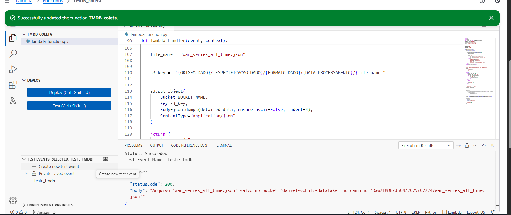

Arquivo criado

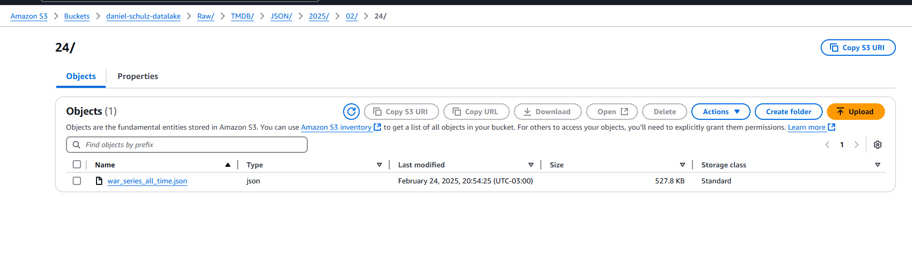