# Desafio DataLake - Parte 2

Comecei criando o diretório Trusted no meu DataLake:

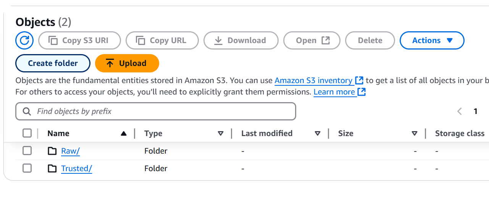

Como inicialmente eu escolhi analisar apenas as séries de Guerra, no CSV eu filtrei as séries do gênero Guerra, mas ao fazer a filtragem percebi que tinha poucos dados com essas condições:

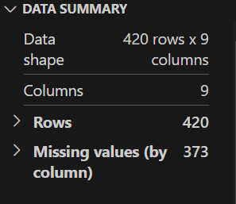

Sendo assim, pensei em analisar dados de séries de Guerra e Crime, então, precisei buscar no TMDB dados de séries de Crime.

## Análises que pretendo fazer

1. Distribuição de Notas IMDb: Analisar a distribuição das notas IMDb para séries de guerra e crime.

2. Tendência de Lançamentos: Verificar a quantidade de séries lançadas por ano para cada gênero.

3. Relação Nota e Votos: Explorar a correlação entre as notas IMDb e o número de votos.

4. Status das Séries: Examinar a distribuição do status das séries e sua relação com as notas.

5. Comparação de Estúdios: Comparar a produção e avaliação média das séries por estúdio.

6. Produção por Estúdio e Ano: Analisar a evolução da produção de séries por estúdio ao longo dos anos.

---

Código Lambda atualizado e executado:

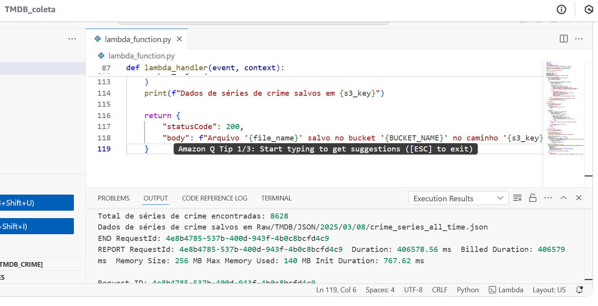

Arquivo gerado:

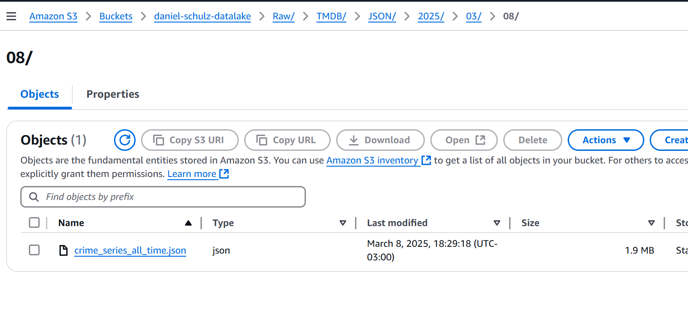

Configurei a role para ter as permissões necessárias para o processamento no Glue

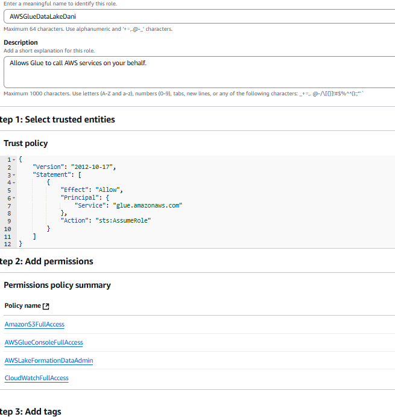

Adicionei a role ao AWS Glue

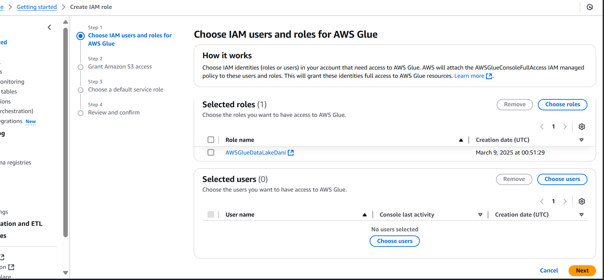

Fornecendo ao Glue o acesso ao S3

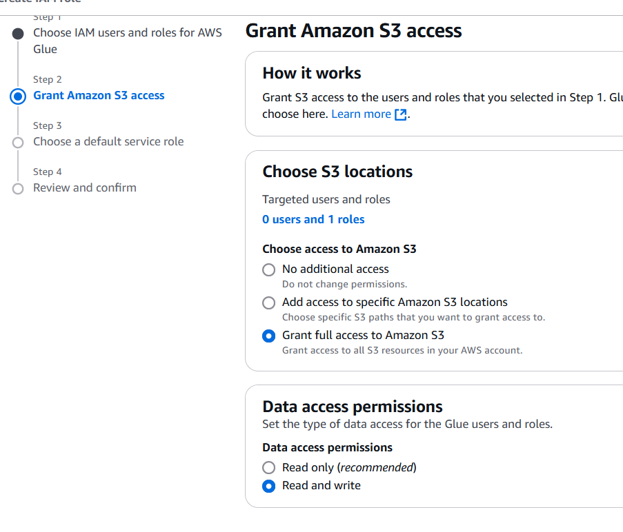

Configuração final do AWS Glue

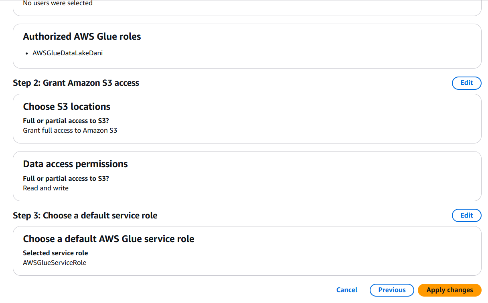

Criei um banco de dados no catálogo do Glue

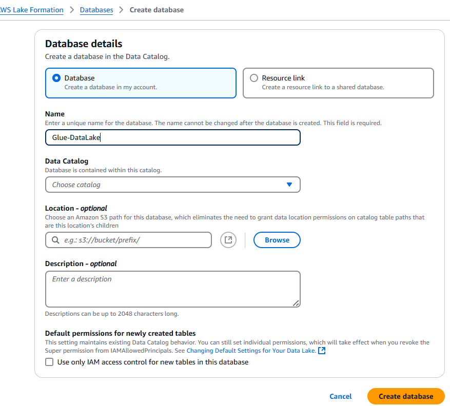

## Criando Job 1
Criei Job no AWS Glue 

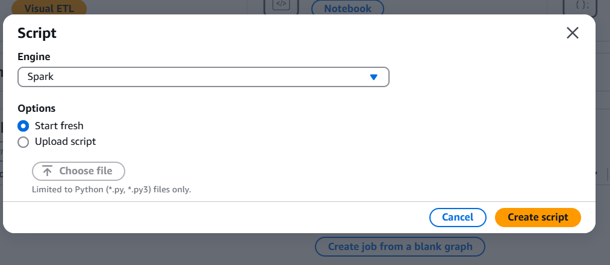

Configurei o Job no AWS Glue

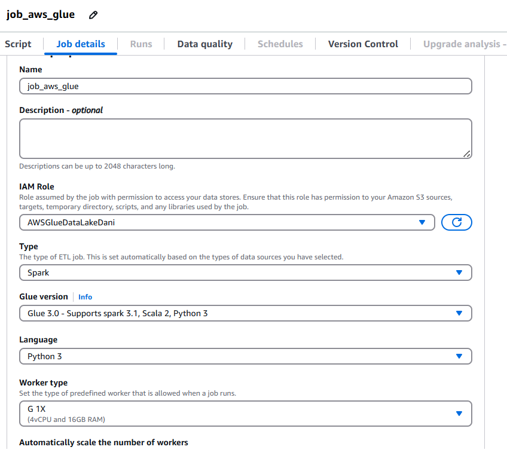

Adicionei os parâmetros dos caminhos de origem e destino no S3

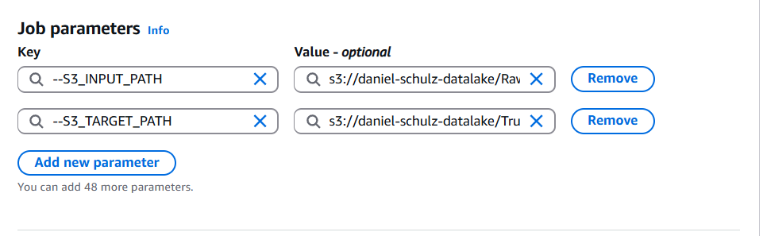

## Analisando o que eu irei tratar no CSV de Series

Pensei em mudar o nome da coluna tituloPincipal para tituloPrincipal, pois estava digitado errado.

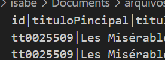

As colunas anoLancamento, anoTermino e tempoMinutos, anoNascimento, anoFalecimento, numeroVotos, notaMedia precisaram ser convertidas para tipo numérico, pois estavam como string.

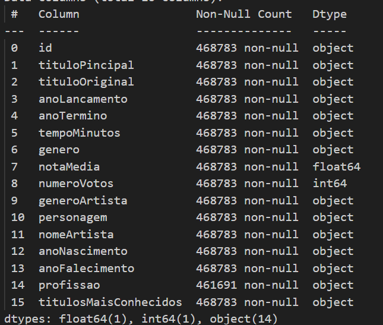

Também idenfiquei valores duplicados, então escolhi remover as duplicatas.

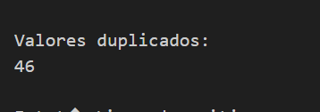

E como optei por fazer análises sobre os gêneros Crime e Guerra, filtrarei para ter os dados do gênero "Crime" ou "War".

## Código para fazer o ETL no AWS Glue (Job 1):

### **1. Importação de Bibliotecas**
```python
import sys
from awsglue.transforms import *
from awsglue.utils import getResolvedOptions
from pyspark.context import SparkContext
from awsglue.context import GlueContext
from awsglue.job import Job
from pyspark.sql.functions import col
```
---

### **2. Obtenção de Parâmetros do Job**
```python
args = getResolvedOptions(sys.argv, ['JOB_NAME', 'S3_INPUT_PATH', 'S3_TARGET_PATH'])
```
- Obtém os argumentos **JOB_NAME**, **S3_INPUT_PATH** (caminho do arquivo de entrada no S3) e **S3_TARGET_PATH** (caminho do arquivo de saída).

---

### **3. Inicialização do Spark e Glue**
```python
sc = SparkContext()
glueContext = GlueContext(sc)
spark = glueContext.spark_session
job = Job(glueContext)
job.init(args['JOB_NAME'], args)
```
---

### **4. Definição dos Caminhos de Entrada e Saída**
```python
source_file = args['S3_INPUT_PATH']
target_path = args['S3_TARGET_PATH']
```
- Define os caminhos do **S3** com base nos parâmetros fornecidos.

---

### **5. Leitura do Arquivo CSV do S3**
```python
df = glueContext.create_dynamic_frame.from_options(
    "s3",
    {"paths": [source_file]},
    "csv",
    {"withHeader": True, "separator": "|"}
)
```
---

### **6. Conversão de DynamicFrame para DataFrame do Spark**
```python
df = df.toDF()
```
- Converti um **DynamicFrame**  para um **DataFrame do Spark**, para permitir a manipulação com PySpark.

---

### **7. Correção de Nome de Coluna**
```python
df = df.withColumnRenamed("tituloPincipal", "tituloPrincipal")
```
- Renomeia a coluna **"tituloPincipal"** para **"tituloPrincipal"** (correção de um erro de digitação).

---

### **8. Conversão de Colunas para Tipo Numérico**
```python
df = df.withColumn("anoLancamento", col("anoLancamento").cast("int"))
df = df.withColumn("anoTermino", col("anoTermino").cast("int"))
df = df.withColumn("tempoMinutos", col("tempoMinutos").cast("int"))
df = df.withColumn("anoNascimento", col("anoNascimento").cast("int"))
df = df.withColumn("anoFalecimento", col("anoFalecimento").cast("int"))
df = df.withColumn("numeroVotos", col("numeroVotos").cast("int"))
df = df.withColumn("notaMedia", col("notaMedia").cast("int"))
```
- Converte as colunas **anoLancamento**, **anoTermino**, **tempoMinutos**, **anoNascimento**, **anoFalecimento**, **numeroVotos** e **notaMedia**  para o tipo **inteiro**.

---

### **9. Remoção de Duplicatas**
```python
df = df.dropDuplicates()
```
---

### **10. Filtragem por Gênero (Crime ou Guerra)**
```python
df_filtered = df.filter(col("genero").rlike("Crime|War"))
```
---

### **11. Salvamento no S3 em Formato Parquet**
```python
df_filtered.write.mode("overwrite").parquet(target_path)
```
---

A Execução foi realizada com sucesso:

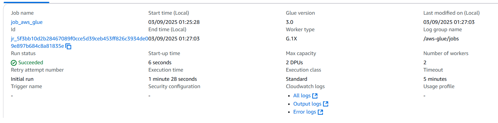

Arquivos gerados:

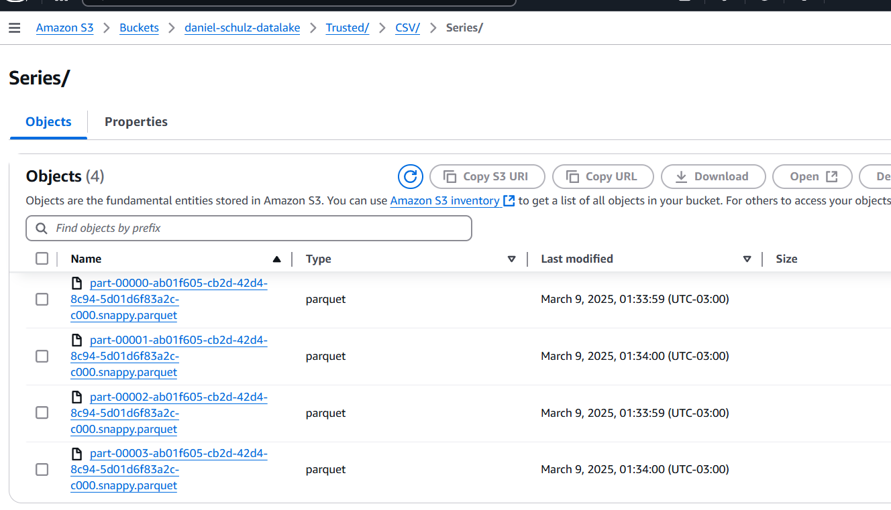

## Criando Job 2

Criando o segundo Job para tratar os dados da API do TMDB

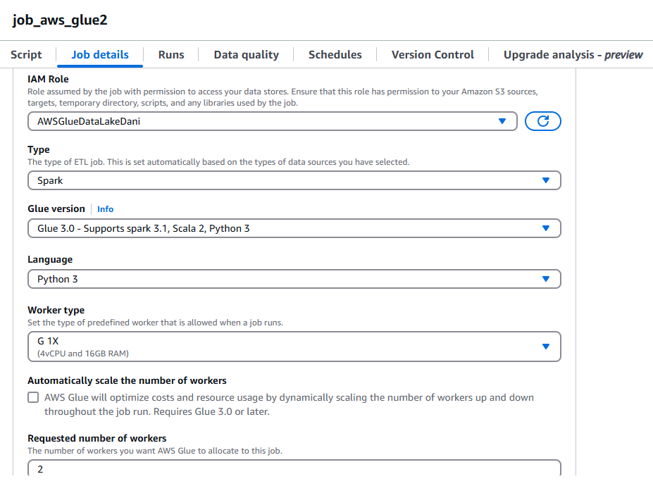

Adicionando parameters ao segundo Job

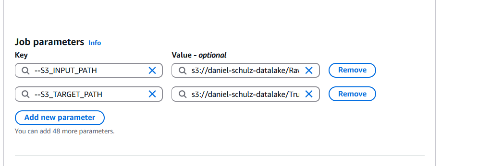


## Analisando o que eu irei tratar no JSON do TMDB

Na coluna numeroEpisodios valores nulos (NaN) serão substituídos por 0 e a coluna será convertida para o tipo int. Pois em muitos casos, um valor nulo em numeroEpisodios pode indicar que a série não tem episódios ou que a informação não está disponível. E também o número de episódios é um valor inteiro. A conversão para int garante que os dados estejam no formato correto para análises futuras.

Tipo da coluna numeroEpisodios

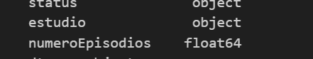

Na coluna estudio valores "N/A" serão substituídos por "Desconhecido". Os textos serão normalizados para maiúsculas. Porque "N/A" é uma forma comum de indicar dados faltantes. Substituí-lo por "Desconhecido" padroniza a representação de valores ausentes. Textos em formatos inconsistentes (como "NHK", "nhk", "Nhk") podem causar problemas em agrupamentos ou filtros. Converter tudo para maiúsculas garante consistência.

Os textos nas colunas tituloOriginal e estudio serão convertidos para maiúsculas, porque textos em maiúsculas facilitam comparações e buscas, evitando problemas como duplicatas causadas por diferenças de caracteres (ex: "Netflix" vs "NETFLIX").


## Código para fazer o ETL no AWS Glue (Job 2):

### **1. Importação das Bibliotecas**
```python
import sys
import datetime
from awsglue.transforms import *
from awsglue.utils import getResolvedOptions
from pyspark.context import SparkContext
from awsglue.context import GlueContext
from awsglue.job import Job
from awsglue.dynamicframe import DynamicFrame
from pyspark.sql.functions import col, upper, when
```
---

### **2. Obtenção de Argumentos do AWS Glue Job**
```python
args = getResolvedOptions(sys.argv, ['JOB_NAME', 'INPUT_PATH', 'OUTPUT_PATH'])
```
---

### **3. Conversão de Caminhos em Listas**
```python
json_paths = args['INPUT_PATH'].split(',')
parquet_base_path = args['OUTPUT_PATH']
```
- O caminho de entrada **INPUT_PATH** é dividido em uma lista de caminhos separados por vírgula, permitindo processar múltiplos arquivos JSON.
- O caminho de saída **OUTPUT_PATH** é atribuído à variável **parquet_base_path**.

---

### **4. Inicialização do Spark e AWS Glue**
```python
sc = SparkContext()
glueContext = GlueContext(sc)
spark = glueContext.spark_session
job = Job(glueContext)
job.init(args['JOB_NAME'], args)
```

---

### **5. Obtendo Data de Execução**
```python
today = datetime.datetime.now()
ano, mes, dia = today.strftime("%Y"), today.strftime("%m"), today.strftime("%d")
```
- Obtém a data atual para organizar os arquivos de saída por ano, mês e dia.

---

### **6. Transformação dos Dados dos Arquivos JSON**
```python
dataframes = []
for path in json_paths:
    dynamic_frame = glueContext.create_dynamic_frame.from_options(
        format_options={"multiline": True},
        connection_type="s3",
        format="json",
        connection_options={"paths": [path], "recurse": True}
    )

    df = dynamic_frame.toDF()
```
- Para cada caminho de arquivo JSON, cria um **DynamicFrame** a partir do S3. A opção **multiline=True** permite que o Glue leia JSON com múltiplas linhas.
- O **DynamicFrame** é convertido em um **DataFrame Spark** para permitir manipulação usando PySpark.

---

### **7. Aplicando Transformações**
```python
    df = df.withColumn("anoLancamento", when(col("anoLancamento") == "", "Desconhecido")
                                       .otherwise(col("anoLancamento").cast("int")))

    df = df.withColumn("numeroEpisodios", when(col("numeroEpisodios").isNull(), 0)
                                         .otherwise(col("numeroEpisodios").cast("int")))

    df = df.withColumn("estudio", when(col("estudio") == "N/A", "Desconhecido")
                                  .otherwise(col("estudio")))

    df = df.withColumn("tituloOriginal", upper(col("tituloOriginal")))
    df = df.withColumn("estudio", upper(col("estudio")))

    dataframes.append(df)
```
- **Transformações** aplicadas ao **DataFrame**:
  - `anoLancamento`: Se estiver vazio, é atribuído "Desconhecido". Caso contrário, é convertido para **inteiro**.
  - `numeroEpisodios`: Se for **NULL**, é substituído por 0, caso contrário, é convertido para **inteiro**.
  - `estudio`: Se o valor for **"N/A"**, é substituído por "Desconhecido".
  - `tituloOriginal` e `estudio`: São convertidos para **maiúsculas**.
- Cada **DataFrame** resultante é adicionado à lista **dataframes**.

---

### **8. União de DataFrames**
```python
df_final = dataframes[0]
for df in dataframes[1:]:
    df_final = df_final.unionByName(df)
```
- Todos os **DataFrames** transformados são unidos em um único **DataFrame** utilizando o método **unionByName**, que combina os dados com base no nome das colunas.

---

### **9. Conversão para DynamicFrame**
```python
transformed_dynamic_frame = DynamicFrame.fromDF(df_final, glueContext, "transformed_df")
```
- O **DataFrame** final é convertido de volta para **DynamicFrame**, que é o formato utilizado pelo AWS Glue para realizar transformações e salvar os dados.

---

### **10. Definindo o Caminho de Saída**
```python
final_path = f"{parquet_base_path}/TMDB/Parquet/Series/{ano}/{mes}/{dia}/"
```
- Define o caminho final onde os arquivos transformados serão salvos no formato **Parquet**. A estrutura de diretórios segue o padrão **ano/mês/dia**.

---

### **11. Escrevendo o DataFrame Transformado no S3 em Parquet**
```python
glueContext.write_dynamic_frame.from_options(
    frame=transformed_dynamic_frame,
    connection_type="s3",
    format="parquet",
    connection_options={"path": final_path} 
)
```
- Grava o **DynamicFrame** transformado no S3, no formato **Parquet**, no caminho especificado.

---

### **12. Finalizando o Job**
```python
print(f"Processamento concluído! Dados salvos em: {final_path}")
job.commit()
```
- Exibe uma mensagem indicando que o processamento foi concluído com sucesso e que os dados foram salvos no caminho final.
- Finaliza o job do Glue com **job.commit()**.

---

A execução foi realizada com sucesso

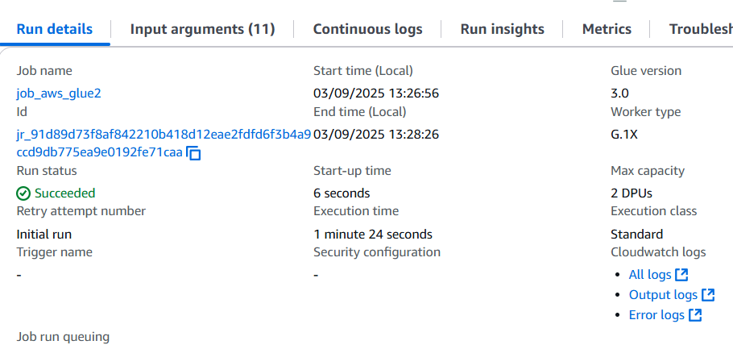

Arquivos gerados no S3

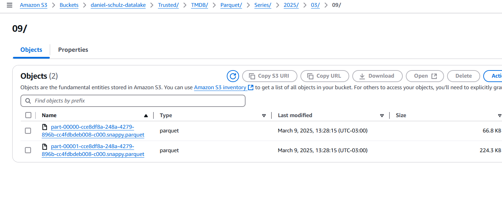

### Catalogando os dados

Criando Crawler 

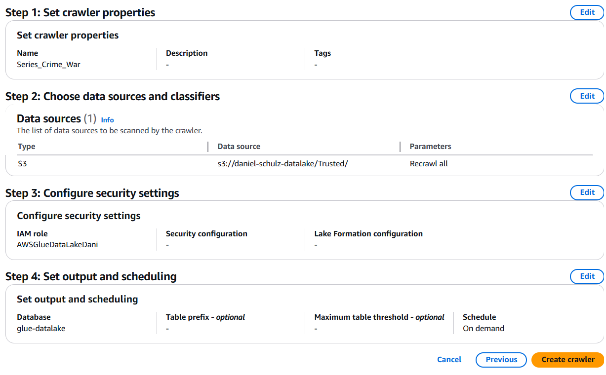

Abrindo o Athena, foi criado as duas tabelas local e tmdb

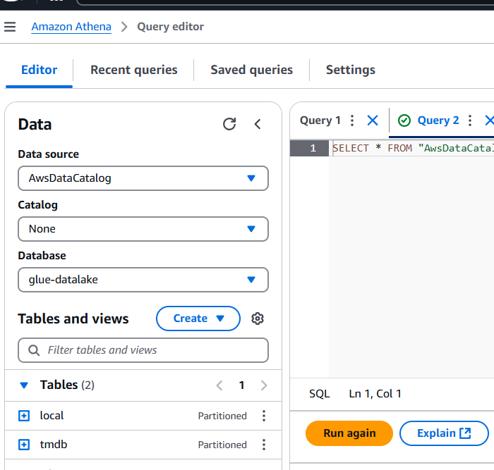

Colunas da tabela local:

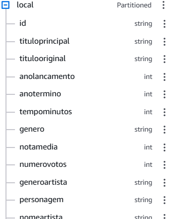

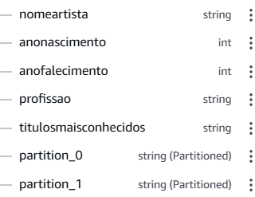

Colunas da tabela tmdb:

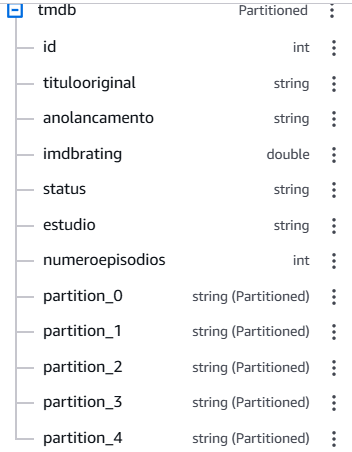

Consulta das primeiras 10 linhas da tabela local:

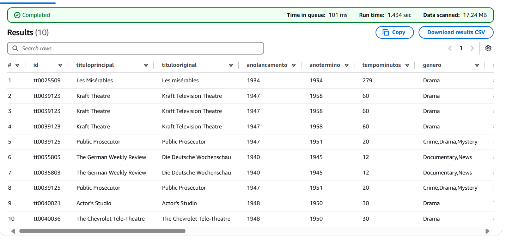

Consulta das primeiras 10 linhas da tabela tmdb:

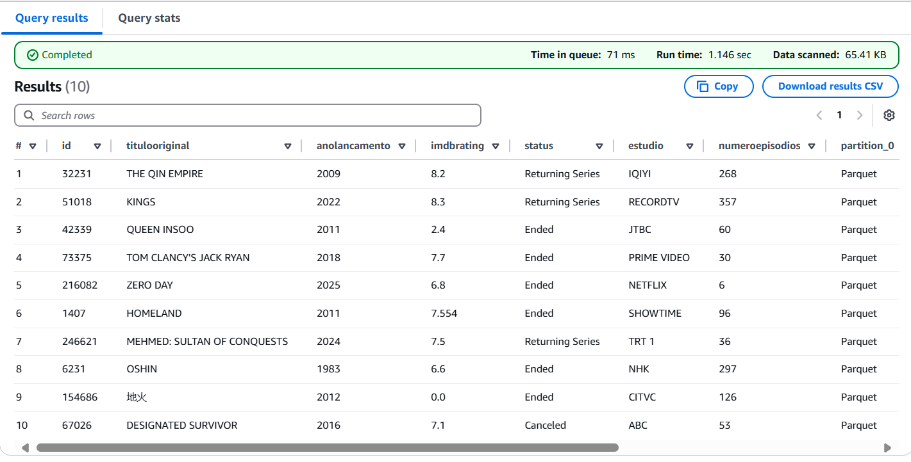
