# Desafio DataLake - Parte 3

Revisando as análises que eu tinha em mente, acabei optando por alterá-las. Sendo assim, preferi escolher o escopo de tecnologia no enredo de séries de guerra e crime para compor as minhas análises. Para isso, eu precisei pegar da API do TMDB palavras-chave de cada série de crime e guerra para saber quais séries possuem temas relacionados a tecnologia nos reus roteiros. 

Ao pegar os dados necessários de séries de crime do TMDB, percebi que todos os campos do ID do IMDB estavam vazios, então precisarei retirar a coluna do ID do IMDB na camada Trusted.

Código lambda executado para pegar dados de séries de crime:

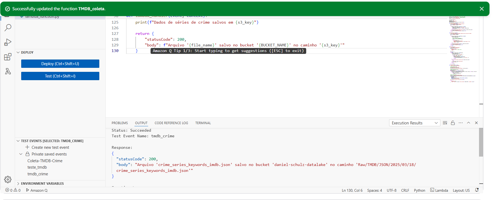

Para pegar os dados de séries de guerra, já não incluí o ID do IMDB, pois estava ciente da falta de dados, então precisarei tratar apenas o primeiro arquivo JSON.


Código lambda executado para pegar dados de séries de guerra:

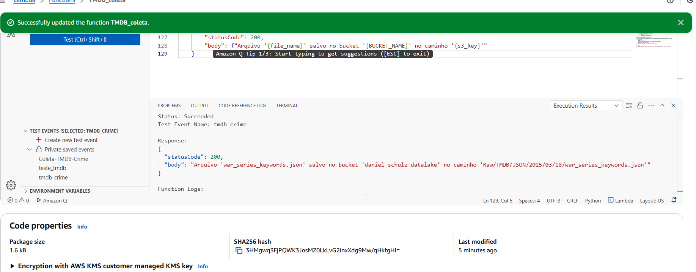

Arquivos no Bucket:

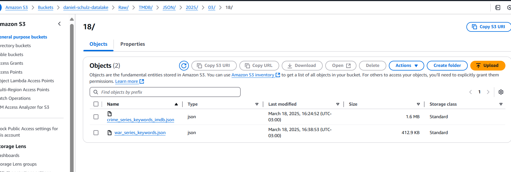

Modifiquei o segundo job criado na sprint anterior para juntar a coluna ``keywords`` ao dataframe do TMDB dos arquivos que eu já tinha antes. No final salvei em parquet no diretório particionado por padrão.

Job 2 atualizado:

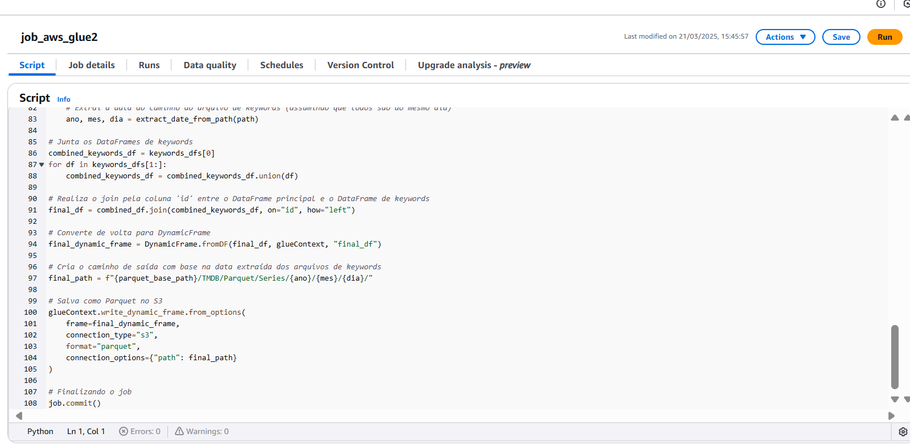

Arquivos gerados na camada Trusted:

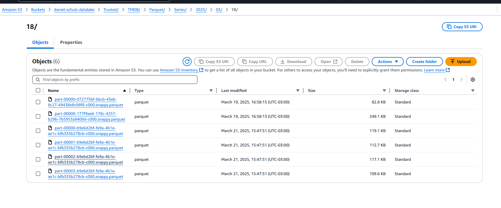


Executei o segundo crawler criado na Sprint 6 que agregava todos os arquivos da camada Trusted 


Nova coluna na tabela tmdb:

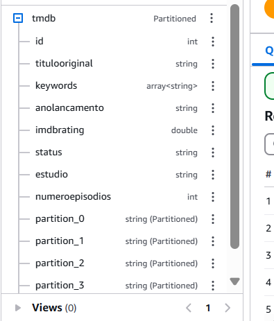


## Análises que pretendo fazer

### **1. A Evolução da Tecnologia nas Séries de Guerra e Crime**  
- **Motivo**: Comparar como a tecnologia foi incorporada ao longo das décadas.  
- **Pergunta**: "Séries mais recentes abordam tecnologia mais avançada?"  
- **Método**:  
  - Contar a quantidade de séries por década para observar tendências.  
  - Assumir que séries mais novas refletem avanços tecnológicos.  


---

### **2. O Impacto da Tecnologia nas Investigações Criminais**  
- **Motivo**: Determinar se séries modernas exploram mais vigilância, IA e análise forense.  
- **Pergunta**: "Séries de crime recentes focam mais em tecnologia investigativa do que as antigas?"  
- **Método**:  
  - Contar séries de crime por década e comparar crescimento.  
  - Relacionar aumento de séries com o avanço da tecnologia forense.  


---

### **3. Tecnologia Militar nas Séries de Guerra**  
- **Motivo**: Analisar se séries de guerra mais recentes retratam drones, IA e armas autônomas.  
- **Pergunta**: "Séries de guerra mais novas enfatizam tecnologia moderna no campo de batalha?"  
- **Método**:  
  - Comparar a produção de séries de guerra ao longo das décadas.  
  - Assumir que séries mais recentes refletem conflitos modernos.  


---

### **4. A Relação entre Tecnologia e Notas no IMDb**  
- **Motivo**: Descobrir se séries que exploram tecnologia recebem melhores avaliações.  
- **Pergunta**: "Séries de crime e guerra com tecnologia no enredo têm melhores notas?"  
- **Método**:  
  - Comparar a média de notas no IMDb por década.  


---

### **5. O Papel dos Estúdios na Produção de Séries Tecnológicas**  
- **Motivo**: Identificar quais estúdios investem mais em séries de crime e guerra com tecnologia.  
- **Pergunta**: "Quais estúdios produzem mais séries tecnológicas?"  
- **Método**:  
  - Contar quantas séries cada estúdio lançou nos gêneros investigados.  


---

### **6. O Tempo de Duração das Séries Tecnológicas**  
- **Motivo**: Verificar se séries que abordam tecnologia tendem a ser mais longas.  
- **Pergunta**: "Séries com enredos tecnológicos têm mais episódios?"  
- **Método**:  
  - Comparar a média de episódios por década.  


---

### **7. A Popularidade de Séries Tecnológicas ao Longo do Tempo**  
- **Motivo**: Medir se séries com temas tecnológicos atraem mais público.  
- **Pergunta**: "Séries que abordam tecnologia recebem mais votos no IMDb?"  
- **Método**:  
  - Comparar a média de votos no IMDb por década.  


---

### **8. Inteligência Artificial e Automação nas Séries de Crime e Guerra**  
- **Motivo**: Verificar se séries modernas exploram mais IA e automação.  
- **Pergunta**: "Séries mais recentes incluem mais IA e automação no enredo?"  
- **Método**:  
  - Contar séries por década e comparar crescimento ao longo do tempo.  

---

## Modelagem dos dados 

Diagrama:

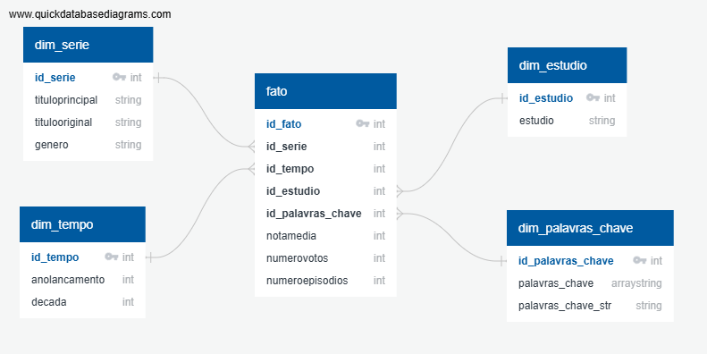


### **1. Modelagem Dimensional (Star Schema)**
O diagrama segue o **esquema em estrela**, onde:
- **Tabela Fato (`fato`)**: Centraliza os dados numéricos e métricas que serão analisados (como `notamedia`, `numerovotos` e `numeroepisodios`).
- **Tabelas de Dimensão (`dim_serie`, `dim_tempo`, `dim_estudio`, `dim_palavras_chave`)**: Fornecem contexto para os dados na tabela fato, como informações sobre séries, tempo, estúdios e palavras-chave.

Achei essa estrutura boa para as análises porque facilita consultas e as tabelas de dimensão são desnormalizadas, o que reduz a necessidade de joins complexos e melhora o desempenho das consultas.

---

### **2. Relação com as Análises Propostas**
A modelagem foi pensada para atender diretamente às minhas perguntas de análise.

#### **Tabela `dim_serie`**
- Contém informações sobre as séries, como `tituloprincipal`, `titulooriginal` e `genero`.
- **Uso nas análises**:
  - Filtragem por gênero (séries de guerra e crime).
  - Identificação de séries específicas para análise de tecnologia.

#### **Tabela `dim_tempo`**
- Contém informações temporais, como `anolancamento` e `decada`.
- **Uso nas análises**:
  - Comparação de séries por década (ex.: evolução da tecnologia ao longo do tempo).
  - Análise de tendências temporais (ex.: aumento de séries com IA em décadas recentes).

#### **Tabela `dim_estudio`**
- Contém informações sobre os estúdios que produziram as séries.
- **Uso nas análises**:
  - Identificação de estúdios que investem em séries tecnológicas.
  - Relação entre estúdios e popularidade das séries.

#### **Tabela `dim_palavras_chave`**
- Contém palavras-chave associadas às séries.
- **Uso nas análises**:
  - Identificação de séries que abordam temas específicos (ex.: IA, drones, vigilância).
  - Análise de tendências em palavras-chave ao longo do tempo.

#### **Tabela `fato`**
- Centraliza as métricas e relaciona as dimensões.
- **Uso nas análises**:
  - Comparação de notas médias (`notamedia`) e votos (`numerovotos`) por década.
  - Análise de duração das séries (`numeroepisodios`).
  - Relacionamento entre tecnologia e popularidade/avaliação das séries.

---

Ao analizar os dados da tabela local, me dei conta de que a coluna ``titulooriginal`` não estava com todos os valores em maiúsculos, então precisarei formatar os valores já que a coluna ``titulooriginal`` da tabela tmdb está com os valores em maiúsculos. Farei isso pois será com essa coluna que farei o relacionamento entre as duas tabelas.

Tabela local com a coluna ``titulooriginal``:

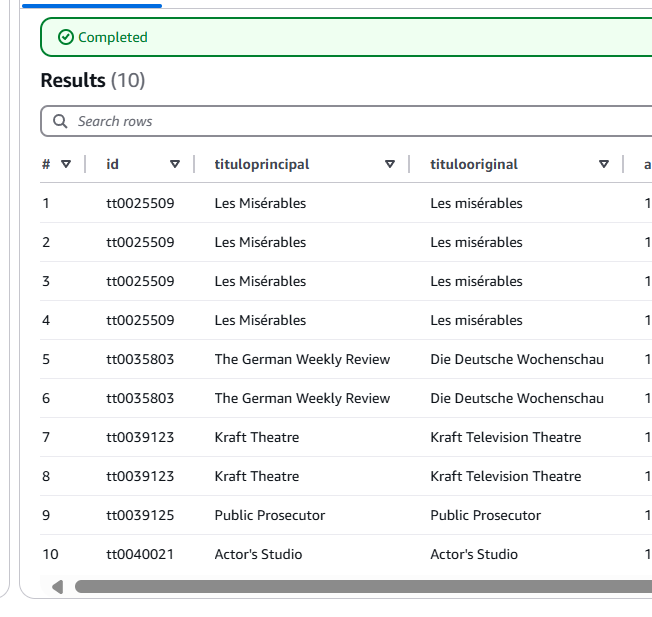

Atualizei o script do primeiro job:

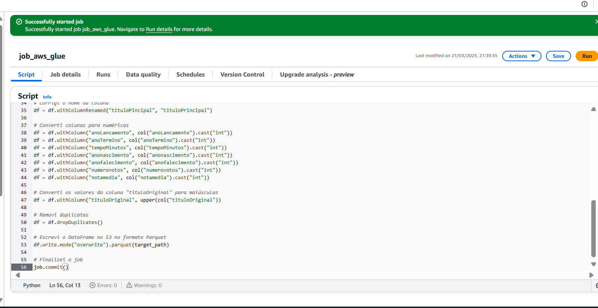

Job executado:

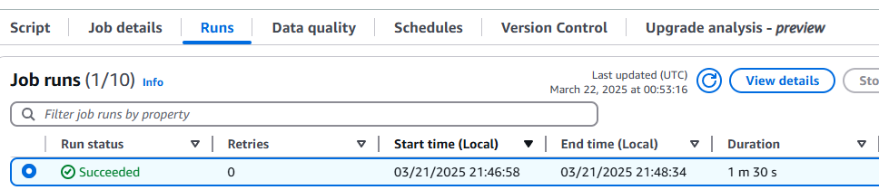

Arquivos atualizados no bucket:

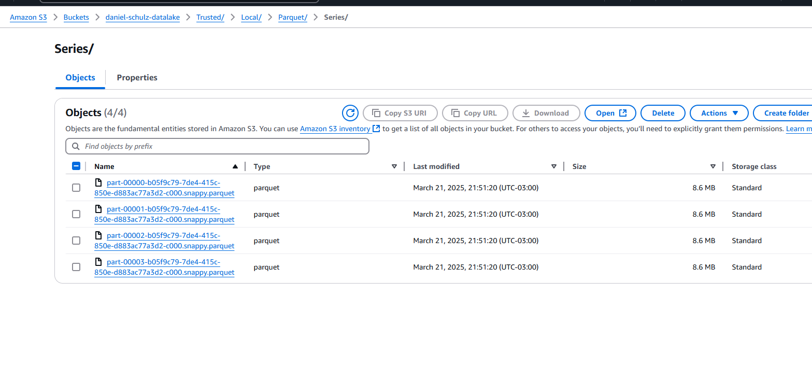

Executando crawler da camada local para atualizar a tabela:

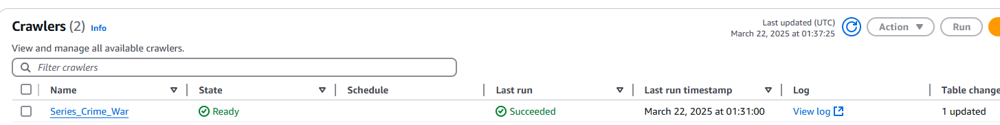

Tabela local atualizada:

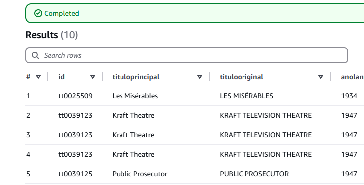

## Começando o tratamento de dados para a Refined

Criei uma database nova onde terá as tabelas que serão criadas com a camada Refined:

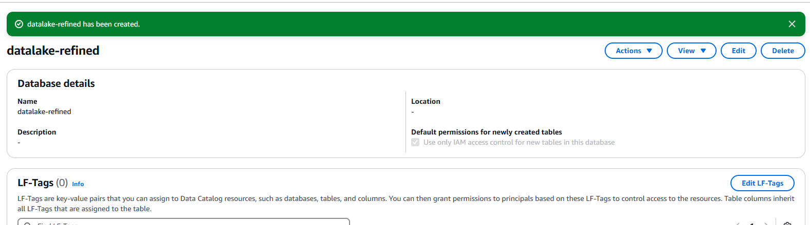

Criei um novo Job para poder fazer o script da modelagem:

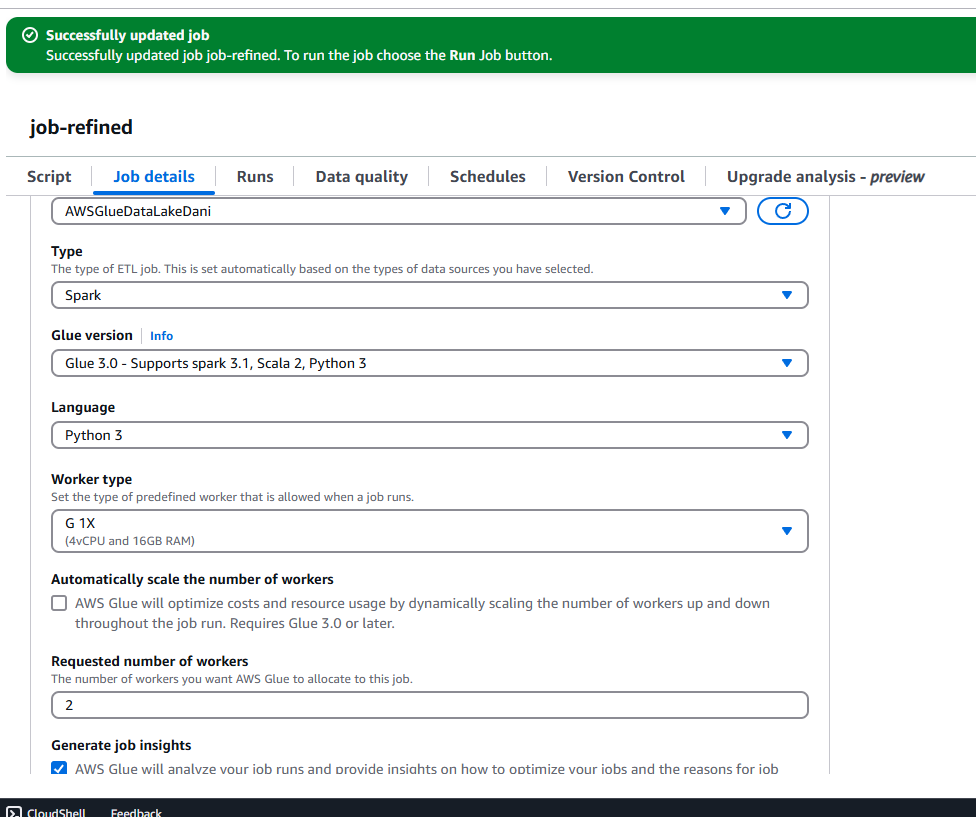

### Script:

Inicialização do Contexto do Glue

```python
args = getResolvedOptions(sys.argv, ['JOB_NAME'])
sc = SparkContext()
glueContext = GlueContext(sc)
spark = glueContext.spark_session
job = Job(glueContext)
job.init(args['JOB_NAME'], args)
```

Neste bloco, inicializei o contexto do AWS Glue e configurei o ambiente Spark. Isso foi necessário para executar as operações de transformação de dados no Glue.

Carregamento dos Dados da Camada Trusted

```python
local_df = glueContext.create_dynamic_frame.from_options(
    connection_type="s3",
    connection_options={"paths": ["s3://daniel-schulz-datalake/Trusted/Local/"]},
    format="parquet"
).toDF()

tmdb_df = glueContext.create_dynamic_frame.from_options(
    connection_type="s3",
    connection_options={"paths": ["s3://daniel-schulz-datalake/Trusted/TMDB/"]},
    format="parquet"
).toDF()
```

Aqui, carreguei os dados da camada Trusted do Data Lake, que estavam armazenados no S3 em formato Parquet. Utilizei dois conjuntos de dados: `local_df` e `tmdb_df`.

Renomeação de Colunas

```python
tmdb_df = tmdb_df.withColumnRenamed("anoLancamento", "anolancamento") \
                 .withColumnRenamed("imdbRating", "notamedia") \
                 .withColumnRenamed("keywords", "palavras_chave") \
                 .withColumnRenamed("numeroEpisodios", "numeroepisodios")
```

Renomeei as colunas do DataFrame `tmdb_df` para garantir consistência com o schema esperado.

Filtragem por Gêneros

```python
local_df = local_df.filter(
    (col("genero").contains("Crime")) | 
    (col("genero").contains("War"))
```

Filtrei o DataFrame `local_df` para incluir apenas séries dos gêneros "Crime" e "War".

Seleção de Colunas

```python
tmdb_df = tmdb_df.select(
    col("tituloOriginal").alias("titulooriginal"),
    "palavras_chave",
    "estudio",
    "numeroepisodios"
)
```

Selecionei as colunas relevantes do DataFrame `tmdb_df` para o meu modelo.

Criação da Coluna Década

```python
local_df = local_df.withColumn("decada", (floor(col("anolancamento") / 10) * 10))
```

Adicionei uma coluna `decada` ao DataFrame `local_df` para facilitar análises temporais.

Seleção de Colunas da Local

```python
local_df = local_df.select(
    "tituloprincipal",
    "titulooriginal",
    "genero",
    "anolancamento",
    "decada",
    "notamedia",
    "numerovotos",
).dropDuplicates()
```

Selecionei as colunas relevantes do DataFrame `local_df` e removi duplicatas.

Junção dos DataFrames

```python
merged_df = local_df.join(
    tmdb_df,
    "titulooriginal",
    "inner"
)
```

Realizei um join entre `local_df` e `tmdb_df` usando a coluna `titulooriginal` como chave.

Geração de IDs para Dimensões

```python
dim_estudio_df = merged_df.select("estudio").distinct()
dim_estudio_df = dim_estudio_df.withColumn("id_estudio", F.row_number().over(Window.orderBy("estudio")))

dim_tempo_df = merged_df.select("anolancamento", "decada").distinct()
dim_tempo_df = dim_tempo_df.withColumn("id_tempo", F.row_number().over(Window.orderBy("anolancamento")))

dim_palavras_chave_df = merged_df.select("palavras_chave").distinct()
dim_palavras_chave_df = dim_palavras_chave_df.withColumn(
    "palavras_chave_str", concat_ws(",", col("palavras_chave"))
).withColumn(
    "id_palavras_chave", F.row_number().over(Window.orderBy("palavras_chave_str"))
)

dim_serie_df = merged_df.select("tituloprincipal", "titulooriginal", "genero").distinct()
dim_serie_df = dim_serie_df.withColumn("id_serie", F.row_number().over(Window.orderBy("titulooriginal")))
```

Criei DataFrames para as dimensões `estudio`, `tempo`, `palavras_chave` e `serie`, gerando IDs únicos para cada registro.

Associação de IDs ao DataFrame Principal

```python
merged_df = merged_df.join(dim_estudio_df, "estudio", "inner")
merged_df = merged_df.join(dim_tempo_df, ["anolancamento", "decada"], "inner")
merged_df = merged_df.join(dim_palavras_chave_df, "palavras_chave", "inner")
merged_df = merged_df.join(dim_serie_df, ["tituloprincipal", "titulooriginal", "genero"], "inner")
```

Associei os IDs das dimensões ao DataFrame principal `merged_df`.

Criação da Tabela Fato

```python
merged_df = merged_df.withColumn("id_fato", F.row_number().over(Window.orderBy("titulooriginal")))
fato_df = merged_df.select(
    "id_fato",
    "id_serie",
    "id_tempo",
    "id_estudio",
    "id_palavras_chave",
    "notamedia",
    "numerovotos",
    "numeroepisodios"
)
```

Criei a tabela fato `fato_df` com os IDs das dimensões e as métricas relevantes.

Salvamento dos Dados na Camada Refined

```python
glueContext.write_dynamic_frame.from_options(
    frame=DynamicFrame.fromDF(fato_df, glueContext, "fato_df"),
    connection_type="s3",
    connection_options={"path": "s3://daniel-schulz-datalake/Refined/fato/"},
    format="parquet"
)

glueContext.write_dynamic_frame.from_options(
    frame=DynamicFrame.fromDF(dim_serie_df, glueContext, "dim_serie_df"),
    connection_type="s3",
    connection_options={"path": "s3://daniel-schulz-datalake/Refined/dim_serie/"},
    format="parquet"
)

glueContext.write_dynamic_frame.from_options(
    frame=DynamicFrame.fromDF(dim_tempo_df, glueContext, "dim_tempo_df"),
    connection_type="s3",
    connection_options={"path": "s3://daniel-schulz-datalake/Refined/dim_tempo/"},
    format="parquet"
)

glueContext.write_dynamic_frame.from_options(
    frame=DynamicFrame.fromDF(dim_estudio_df, glueContext, "dim_estudio_df"),
    connection_type="s3",
    connection_options={"path": "s3://daniel-schulz-datalake/Refined/dim_estudio/"},
    format="parquet"
)

glueContext.write_dynamic_frame.from_options(
    frame=DynamicFrame.fromDF(dim_palavras_chave_df, glueContext, "dim_palavras_chave_df"),
    connection_type="s3",
    connection_options={"path": "s3://daniel-schulz-datalake/Refined/dim_palavras_chave/"},
    format="parquet"
)
```

Salvei os DataFrames resultantes na camada Refined do Data Lake, em formato Parquet.

Commit do Job

```python
job.commit()
```

Finalizei o job do Glue, confirmando a execução bem-sucedida das transformações.

Script no job:

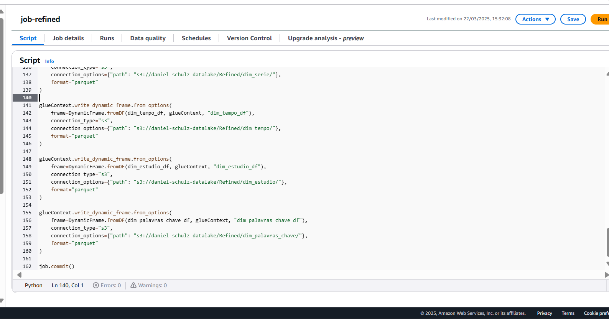

Execução realizada com sucesso:

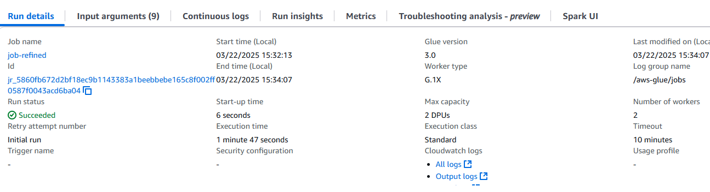

Arquivos parquet armazenados na camada Refined particionados pelos nomes de suas tabelas

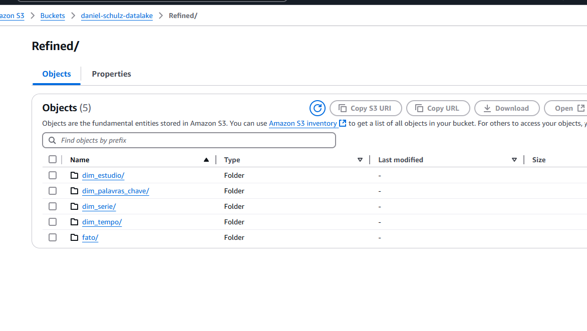

Criando Crawler para a camada Refined:

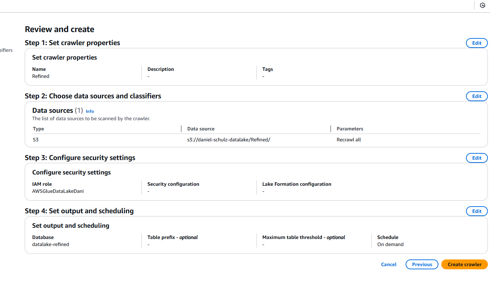

Crawler executado com sucesso:

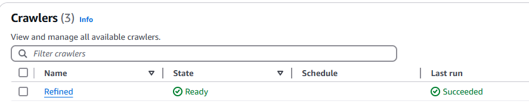

Tabelas no AWS Athena:

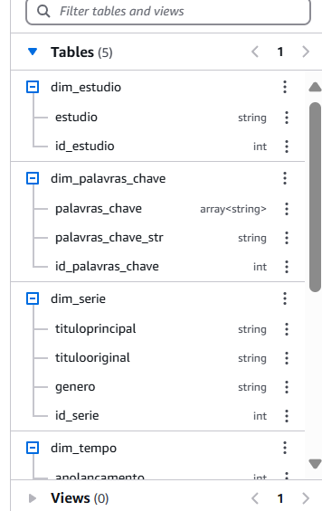
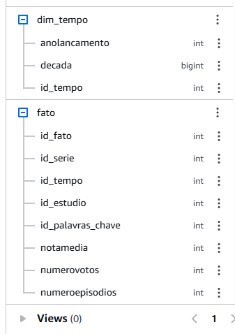

Consulta teste no AWS Athena das primeiras 10 linhas da tabela fato:

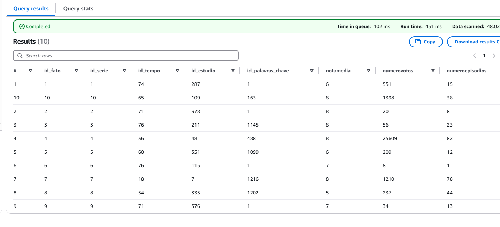