# Desafio DataLake - Parte 4

Primeiramente, fiz alteração no diagrama da modelagem de dados de acordo com o que foi sugerido no feedback técnico na Sprint 7, coloquei a coluna "anoLancamento" da dimensão "tempo" na "fato".

Diagrama atualizado:

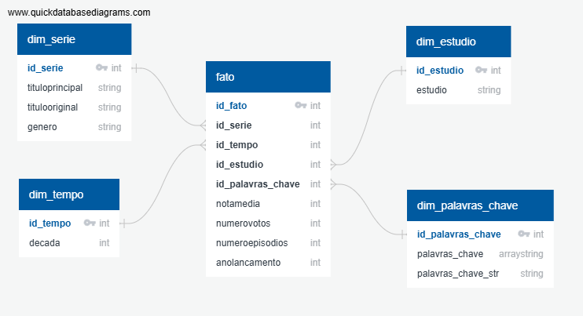

Código do AWS Glue atualizado:

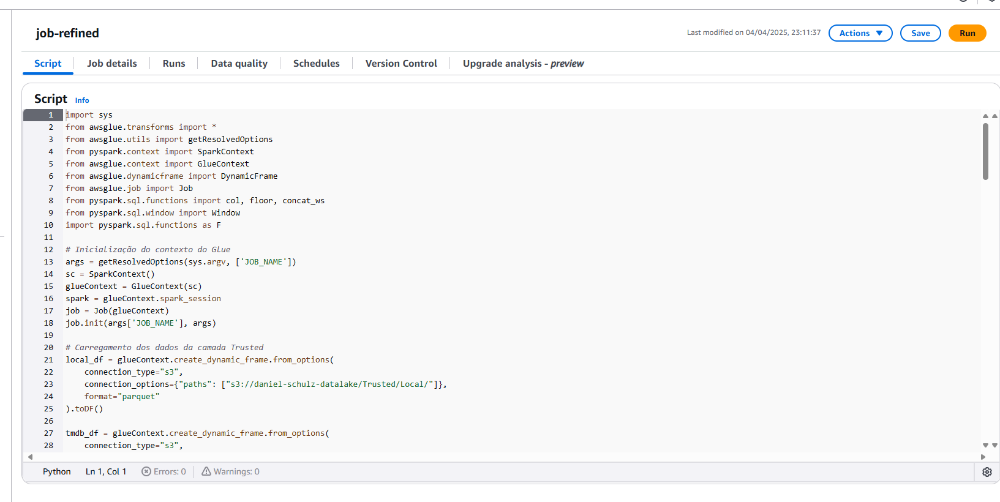

Script executado:

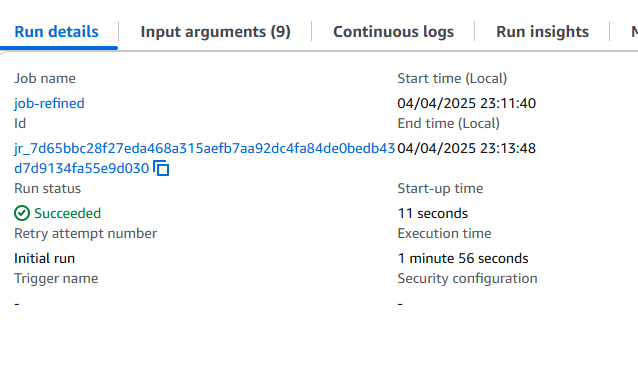

Novo arquivos na camada Refined:

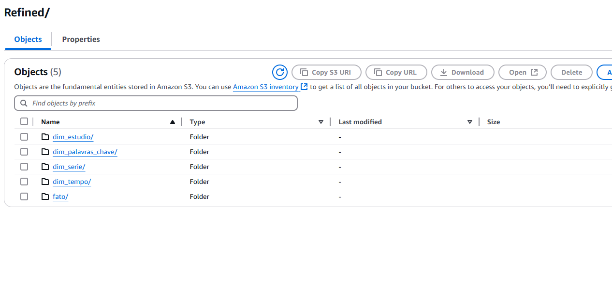

Executando Crawler:

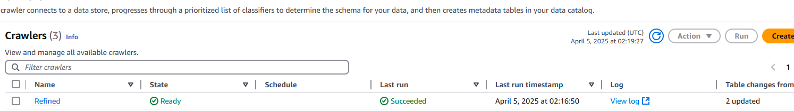

Modificações nas tabelas do Athena:

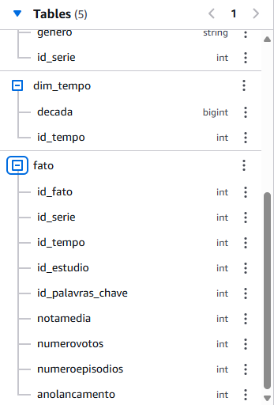

## Criando View

Primeiramente, no Athena eu criei uma View para poder ser utilizada no QuickSight, pois eu sabia que no QuickSight eu poderia importar apenas uma tabela por dataset.

Esta é View chamada `series_completa_view` que combina dados de várias tabelas e adiciona campos calculados baseados em palavras-chave.

### Criação da View
```sql
CREATE OR REPLACE VIEW series_completa_view AS
```
- Cria ou substitui uma visão chamada `series_completa_view`

### Seleção de campos básicos
```sql
SELECT 
    f.id_fato,
    f.notamedia,
    f.numerovotos,
    f.numeroepisodios,
    f.anolancamento,
    
    s.tituloprincipal,
    s.titulooriginal,
    s.genero,
    
    t.decada,
    
    e.estudio,
    
    p.palavras_chave_str,
```
- Seleciona campos das tabelas:
  - `fato` (f): id, nota média, número de votos, episódios e ano de lançamento
  - `dim_serie` (s): título principal, título original e gênero
  - `dim_tempo` (t): década
  - `dim_estudio` (e): estúdio
  - `dim_palavras_chave` (p): string com palavras-chave concatenadas

### Campo calculado para tecnologia
```sql
    CASE WHEN p.palavras_chave_str LIKE '%technology%' OR 
               p.palavras_chave_str LIKE '%tech%' OR
               p.palavras_chave_str LIKE '%computer%' OR
               p.palavras_chave_str LIKE '%digital%' OR
               p.palavras_chave_str LIKE '%internet%' OR
               p.palavras_chave_str LIKE '%software%' OR
               p.palavras_chave_str LIKE '%hardware%' OR
               p.palavras_chave_str LIKE '%cyber%' OR
               p.palavras_chave_str LIKE '%robot%' OR
               p.palavras_chave_str LIKE '%drone%' OR
               p.palavras_chave_str LIKE '%virtual reality%' OR
               p.palavras_chave_str LIKE '%vr%' OR
               p.palavras_chave_str LIKE '%ar%' OR
               p.palavras_chave_str LIKE '%augmented reality%' OR
               p.palavras_chave_str LIKE '%machine%' OR
               p.palavras_chave_str LIKE '%data%' OR
               p.palavras_chave_str LIKE '%algorithm%' 
               THEN 1 ELSE 0 END AS flag_tecnologia,
```
- Cria um campo binário (1/0) que indica se a série está relacionada a tecnologia
- Verifica diversos termos como "tech", "computer", "digital", "robot", etc.

### Campo calculado para IA (Inteligência Artificial)
```sql
CASE 
    WHEN palavras_chave_str LIKE '%ai%' OR 
         palavras_chave_str LIKE '%artificial intelligence%' OR
         palavras_chave_str LIKE '%machine learning%' OR
         palavras_chave_str LIKE '%deep learning%' OR
         palavras_chave_str LIKE '%neural network%' OR
         palavras_chave_str LIKE '%chatbot%' OR
         palavras_chave_str LIKE '%virtual assistant%' OR
         palavras_chave_str LIKE '%autonomous system%' OR
         palavras_chave_str LIKE '%algorithmic intelligence%' OR
         palavras_chave_str LIKE '%computer vision%' OR
         palavras_chave_str LIKE '%nlp%' OR
         palavras_chave_str LIKE '%natural language processing%' OR
         palavras_chave_str LIKE '%singularity%' OR
         palavras_chave_str LIKE '%androids%' OR
         palavras_chave_str LIKE '%sentient%' OR
         palavras_chave_str LIKE '%cybernetic%' OR
         palavras_chave_str LIKE '%smart algorithm%' OR
         palavras_chave_str LIKE '%intelligent system%' OR
         palavras_chave_str LIKE '%cognitive computing%' OR
         palavras_chave_str LIKE '%ai assistant%' OR
         palavras_chave_str LIKE '%ai warfare%' OR
         palavras_chave_str LIKE '%robotic intelligence%' OR
         palavras_chave_str LIKE '%machine mind%'
         THEN 1 
    ELSE 0 
END AS flag_ia,
```
- Cria um campo binário para identificar séries sobre IA
- Inclui termos técnicos como "machine learning", "neural network", "nlp", etc.
- Também inclui termos populares e cenários futuristas

### Campo calculado para tecnologias militares
```sql
    CASE WHEN p.palavras_chave_str LIKE '%military%' OR 
               p.palavras_chave_str LIKE '%war%' OR
               p.palavras_chave_str LIKE '%battle%' OR
               p.palavras_chave_str LIKE '%soldier%' OR
               p.palavras_chave_str LIKE '%army%' OR
               p.palavras_chave_str LIKE '%navy%' OR
               p.palavras_chave_str LIKE '%air force%' OR
               p.palavras_chave_str LIKE '%combat%' OR
               p.palavras_chave_str LIKE '%weapon%' OR
               p.palavras_chave_str LIKE '%drone%' OR
               p.palavras_chave_str LIKE '%missile%' OR
               p.palavras_chave_str LIKE '%tank%' OR
               p.palavras_chave_str LIKE '%special forces%' OR
               p.palavras_chave_str LIKE '%marine%' OR
               p.palavras_chave_str LIKE '%commando%' OR
               p.palavras_chave_str LIKE '%militar%' OR
               p.palavras_chave_str LIKE '%exército%' OR
               p.palavras_chave_str LIKE '%batalha%' 
               THEN 1 ELSE 0 END AS flag_militar,
```
- Identifica séries com tecnologias militares
- Inclui termos em inglês e português como "air force", "drone", "missile", etc.


### Junções (JOINs) entre tabelas
```sql
FROM 
    fato f
JOIN dim_serie s ON f.id_serie = s.id_serie
JOIN dim_tempo t ON f.id_tempo = t.id_tempo
JOIN dim_estudio e ON f.id_estudio = e.id_estudio
JOIN dim_palavras_chave p ON f.id_palavras_chave = p.id_palavras_chave;
```
- Relaciona a tabela fato com as tabelas de dimensões:
  - `dim_serie` (séries)
  - `dim_tempo` (tempo)
  - `dim_estudio` (estúdios)
  - `dim_palavras_chave` (palavras-chave)

Esta view consolida informações de várias tabelas em uma única visão analítica, adicionando flags que facilitam a filtragem por temas específicos.


View criada:

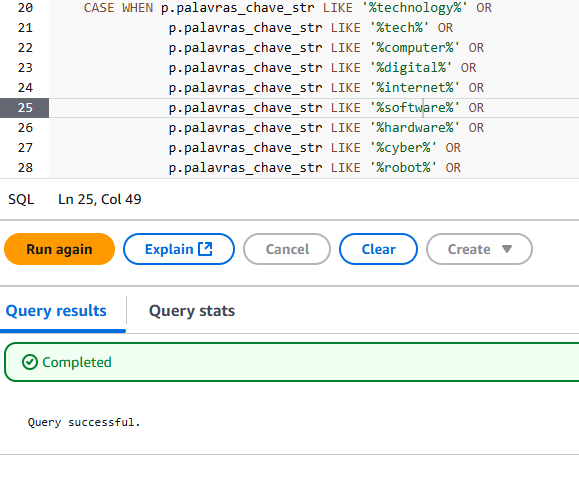

## QuickSight: Primeiros passos

Ao fazer a importação da View do Athena no QuickSight, fui informado que eu não tinha permissão aos dados do S3, então fui resolver esse problema nas configurações do QuickSight.


### Importando View do Athena:

Selecionando fonte de dados (Athena):

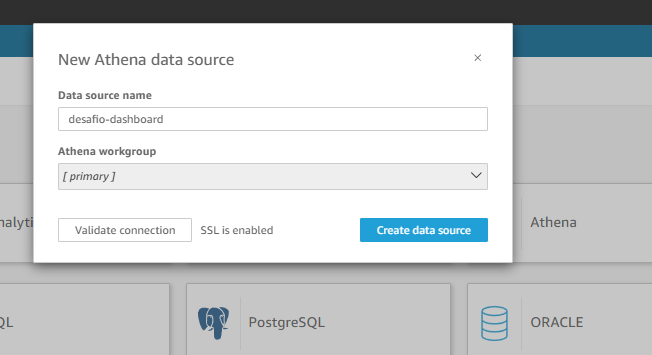

Selecionando a database da Refined e a View criada no Athena:

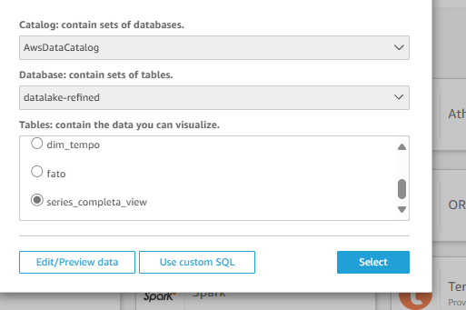

Selecionando a opção "Directly query your data" e após em "Visualize":

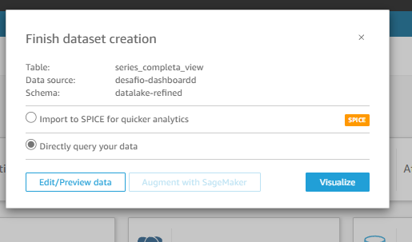

## QuickSight: Construção dos Gráficos

### Escolha dos gráficos:

**KPIs (2,548 séries | 13.7% com tech | 6.73 IMDb)**
→ Contextualizar o volume de dados, penetração tecnológica no universo analisado e a média geral das avaliações das séries.

**Gráfico de barras: "Nota média por década (com/sem tech)"**
→ Comprovar que séries com tecnologia têm avaliações consistentemente mais altas.

**Gráfico de barras: "Séries de Crime com tecnologia por década"**
→ Mostrar a evolução temporal da adoção de temas tecnológicos nas séries de crime.

**Heatmap para análise por década (guerra)**
→ Visualizar simultaneamente a frequência (intensidade da cor) e a evolução temporal (eixos) da tecnologia militar, destacando padrões não lineares.

**Gráfico de linhas: "Séries com tecnologia por década"**
→ Mostrar a evolução temporal geral da adoção de temas tecnológicos.

**Gráfico de barras horizontais: "Nº médio de episódios"**
→ Revelar que séries tech são mais longas (50.2 vs. 46.8 episódios), contrariando a tendência de produções enxutas.

**Gráfico de barra horizontal: "Top 5 estúdios"**
→ Identificar os líderes na produção de séries tech, refletindo estratégias de catálogo distintas.

### Construção dos gráficos

No primeiro KPI fiz a contagem do campo "id_fato" para descobrir quantas séries serão analisadas:

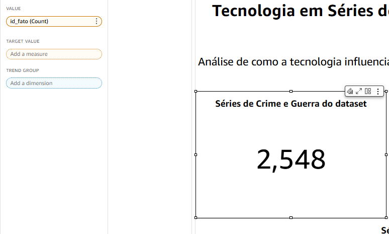

Fiz a média percentual do campo "flag_tecnologia" para descobrir qual a porcentagem de séries que tem tecnologia no enredo:

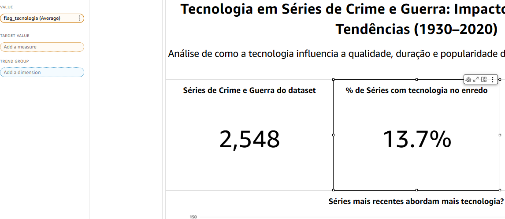

Fiz a média de todas as notas do IMDb do dataset com o campo "notamedia"

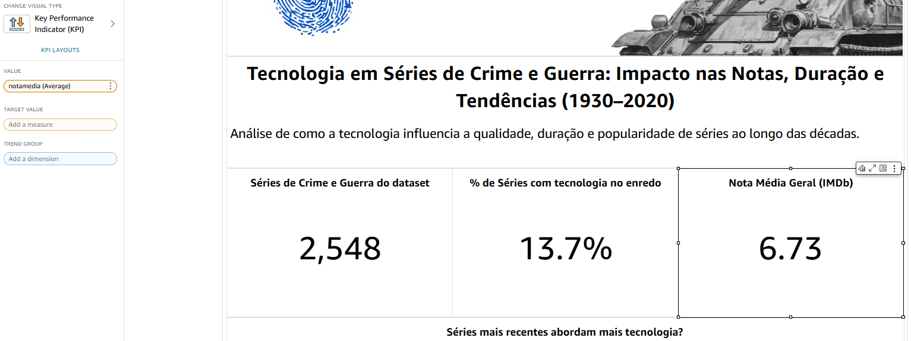

Nesse gráfico coloquei no eixo x o campo "decada" o no valor a contagem do campo "id_fato" seguido do filtro com a flag_tecnologia igual a 1, para agregar apenas séries com temas tecnológicos:

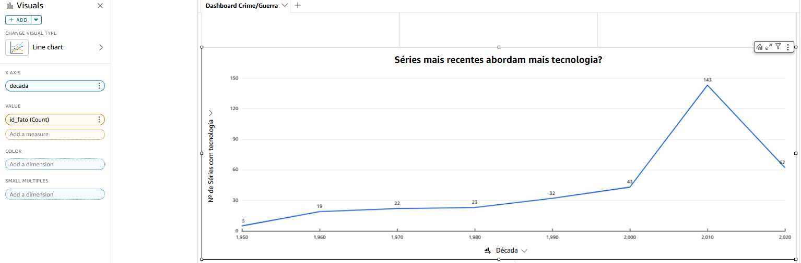

Filtro:

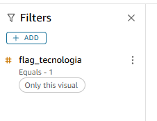

Nesse gráfico coloquei no eixo x o campo "decada", no valor a contagem do campo "categoria_tecnologia" que criei para deixar visualmente compreensível ao invés de 0 e 1, e na cor e grupo coloquei também o campo categoria_tecnologia. Além disso, filtrei para o campo "genero_principal" ser igual a Crime, esse campo também criei para facilitar a criação dos gráficos no momento de fazer as análises de gêneros. E por fim, incluí como filtro para ser apenas séries com tecnologia.

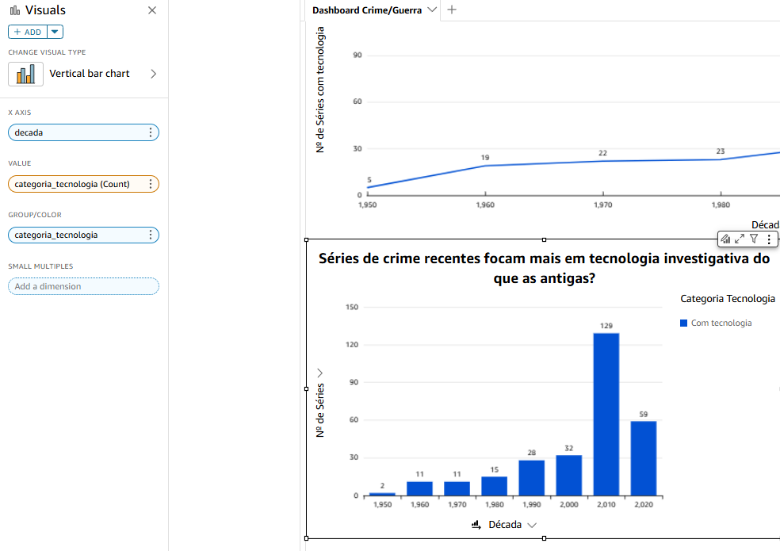

Filtros:

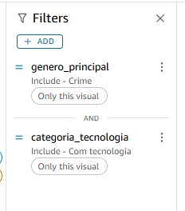

Campos calculados:

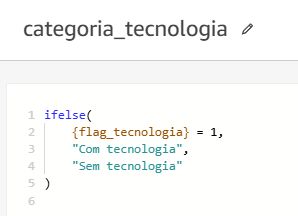

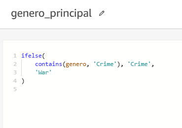

Nesse gráfico, nas linhas coloquei o campo "categoria_militar" que criei para facilitar a compreensão nas análises, nas colunas tem o campo "decada" e nos valores tem a contagem do campo "id_fato", além dos filtros tendo genero_principal incluindo apenas Guerra e categoria_militar incluindo apenas séries com tecnologia.

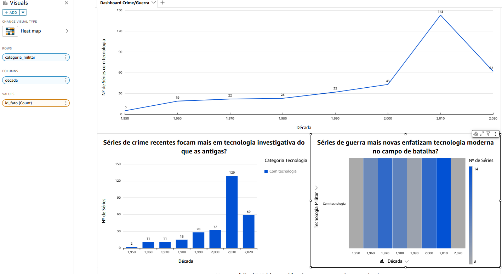

Filtros:

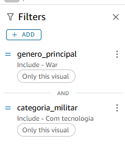

Campo calculado:

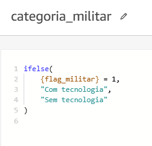

Para esse gráfico, no eixo x coloquei o campo "decada", no valor coloquei a média do campo "notamedia" e na cor/grupo coloquei o campo "categoria_tecnologia":

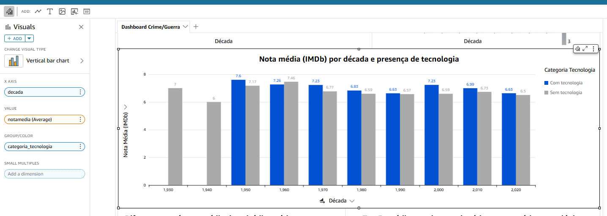

Nesse gráfico, coloquei no eixo x o campo "categoria_tecnologia" e no valor coloquei a média do campo "numerosepisodios"

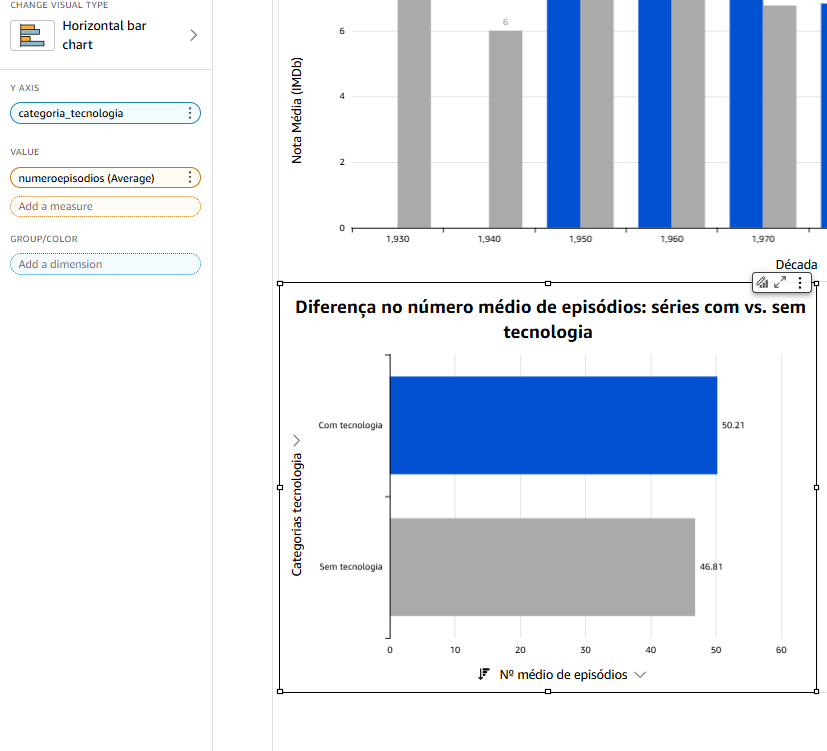

No eixo y desse gráfico coloquei o campo "estudio" e no valor coloquei a contagem do campo "id fato", também, coloquei filtros, sendo o primeiro "flag_tecnologia" igual a 1 e o segundo sendo o top 5 do campo "estudio".

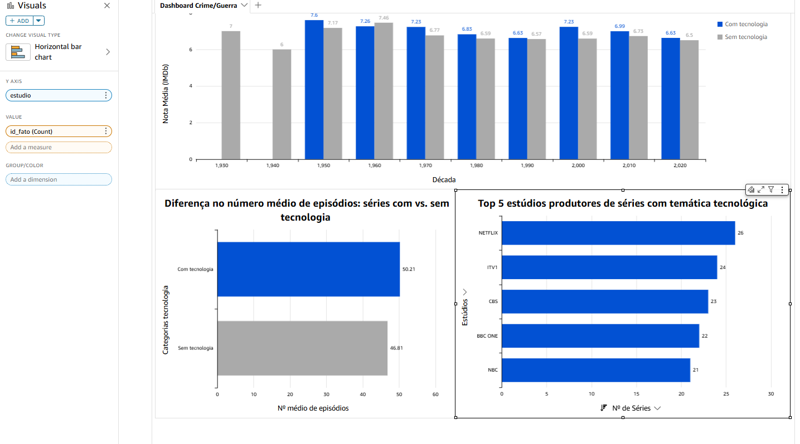

Filtros:

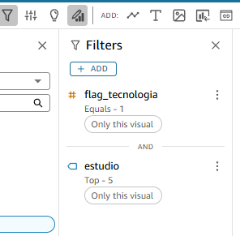

## QuickSight: Desenvolvimento do Dashboard

### Estrutura e Design

- **Capa e Introdução**: Elaborei uma capa com título impactante e introdução explicando o contexto da análise (1930-2020)

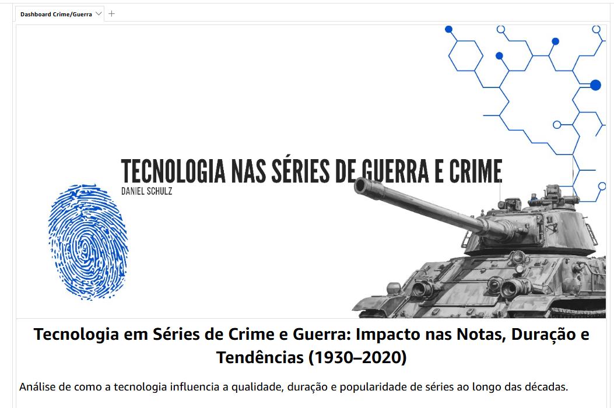

- **Padronização Visual**: Cores temáticas: azul para tecnologia e cinza para a ausência da tecnologia.

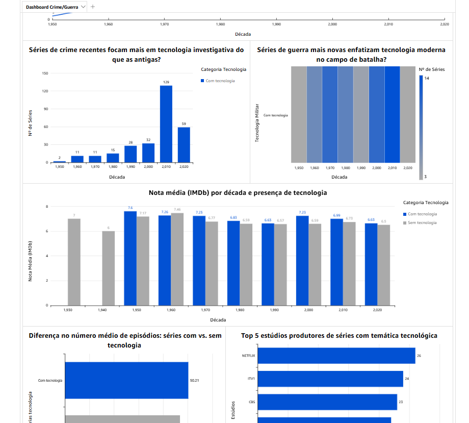

### KPIs Principais
1. **Dados Básicos**:
   - 2,548 séries analisadas
   - 13.7% com temática tecnológica
   - Nota média geral: 6.73 (IMDb)

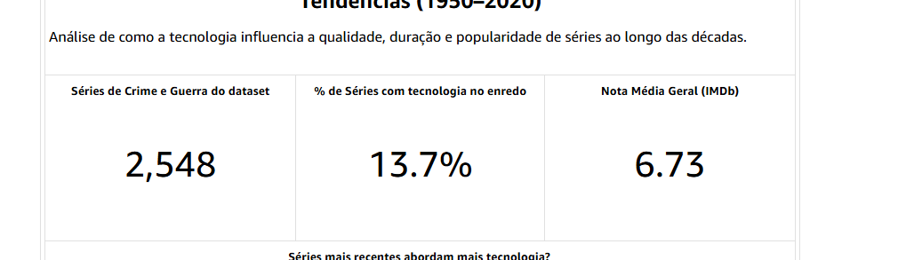

2. **Tendências Temporais**:
   - Gráficos de década mostram crescimento exponencial de tecnologia pós-2000
   - Destaque para crime (tecnologia investigativa) vs guerra (tecnologia militar)

Observação: Na década de 2020 os números são mais baixos que de 2010 pois tenho apenas dados do ano de 2020, isso aconteceu pelo fato do CSV ter séries até esse ano, porém, pode-se concluir que ainda cresce exponencialmente a temática tecnológica nas séries da década atual baseando-se pela década passada e os números de 2020.

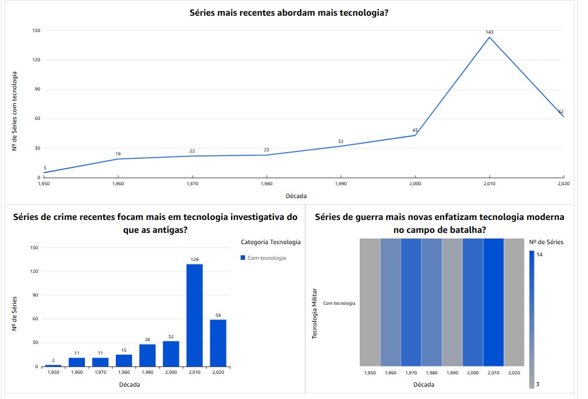

### Análises Chave
- **Notas**: Séries com tecnologia têm avaliações mais altas
- **Duração**: Séries tecnológicas são 7% mais longas (50.2 vs 46.8 episódios em média)
- **Estúdios**: Netflix lidera produções recentes com temática tecnológica

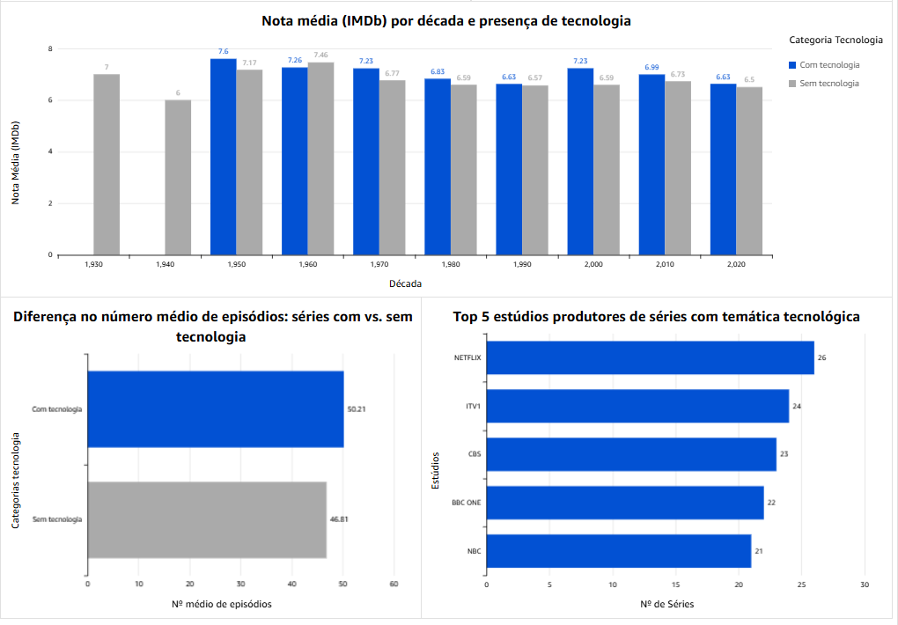

## Conclusão

Ao percorrer as décadas de 1930 a 2020, fica claro que a tecnologia conquistou um lugar central nas séries de crime e guerra. O que começou como um elemento ocasional — rádios em campos de batalha ou impressões digitais em investigações — transformou-se no coração das novas narrativas.  

Nos anos 50, as séries com tecnologia já se destacavam, recebendo notas mais altas no IMDb. Mas o verdadeiro boom veio após 2000, refletindo a dependência global de inovação.  

A guerra, sempre termômetro dos avanços reais, antecipou essa tendência. Enquanto séries de crime focavam em DNA e câmeras de segurança, as de guerra traziam drones e inteligência artificial para o campo de batalha — muitas vezes antes mesmo dessas tecnologias se tornarem comuns na vida real.  

A análise revelou um dado curioso: as séries com temática tecnológica são, na verdade, mais longas (50.2 episódios) que as tradicionais (46.8). Esse insight pode significar:

Audiência Engajada: Fãs de ficção tecnológica consomem mais conteúdo.

Complexidade Narrativa: Sistemas tecnológicos (como IA ou cybercrime) demandam mais tempo para o processo de construção de um mundo imaginário.

Por trás dessas histórias, a Netflix emerge como a nova contadora de mitos tecnológicos, ultrapassando estúdios tradicionais como BBC e CBS. 

**Insight Final**:  
As séries não apenas retratam o avanço tecnológico — elas o antecipam, moldando nosso imaginário sobre o futuro. E se os dados não mentem, a próxima década reserva ainda mais histórias onde a tecnologia será protagonista.  

